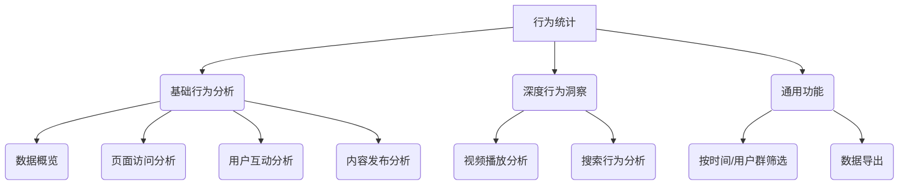
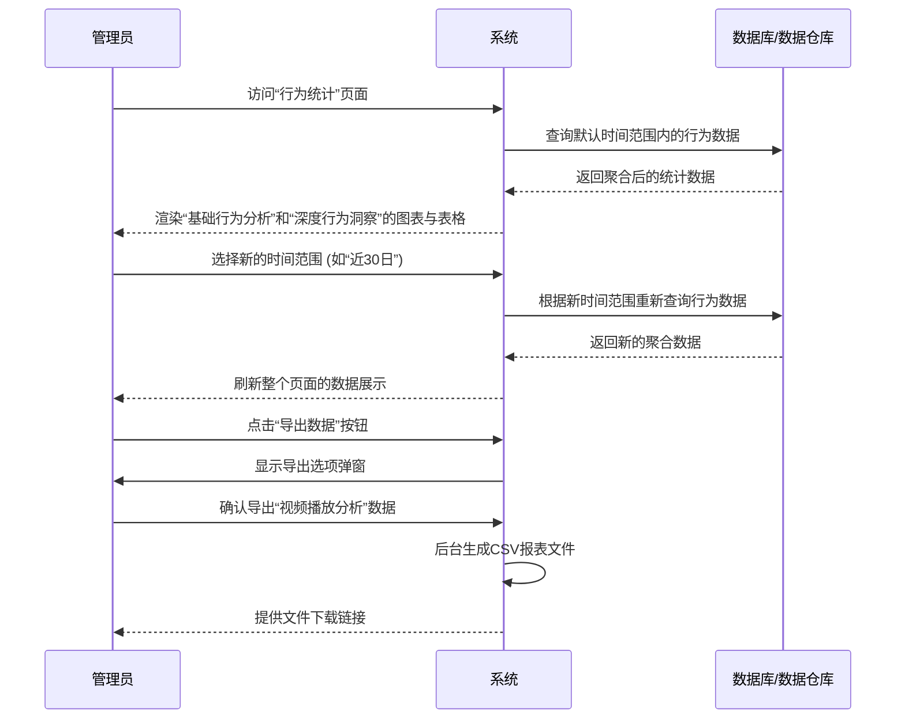

# 人民城轨-运营平台-功能需求文档 (FRD)

**版本**: v1.0
**日期**: 2024-07-29
**负责人**: [产品经理姓名]

> 本文档旨在详细定义“人民城轨-运营平台”产品的功能需求。本文档将作为研发、测试和设计团队的工作依据，确保各方对产品功能有统一、清晰的理解。

---

## 一、 运营平台

### 1. 数据看板 (Dashboard)
1.  **核心数据概览**: 实时展示平台核心运营指标，例如：新增用户数、日活跃用户（DAU）、内容发布量、总互动数（点赞、评论、分享）。
2.  **待办事项提醒**: 集中展示待处理任务，例如：待审核内容数量、待处理用户反馈、系统异常警报等。运营人员可直接从提醒入口跳转至相应处理页面。
3.  **数据趋势图表**: 以图表形式展示关键数据（如用户增长、内容发布趋势）在近期（如7日、30日）的变化趋势。
4.  **近期活动**: 动态展示平台最新的操作日志，如：新用户注册、重要内容发布、关键审核完成、直播开始等。
5.  **系统健康监控**:
    *   **实时状态**: 以仪表盘形式展示服务器CPU、内存、磁盘、网络的使用率。
    *   **服务状态**: 监控数据库、核心API的响应时间及状态。
6.  **快捷操作**: 提供常用功能入口，如：批量审核、用户导出、手动数据备份、系统健康检查等，方便运营人员快速执行任务。
7.  **可定制化**:
    *   **报表导出**: 支持运营人员按需导出指定时间范围和格式的数据报表。
    *   **显示设置**: 允许用户自定义设置看板的自动刷新频率、告警等级等。

### 2. 内容管理 (ContentManagement)
1.  **内容列表与检索**:
    *   **多维度筛选**: 支持按内容ID、关键词、内容类型（视频、图文）、发布板块、发布状态（已发布、待审核、已下架）、发布时间等多维度进行筛选和搜索。
    *   **数据聚合展示**: 列表清晰展示内容的核心信息，包括：标题、封面、类型、发布者、发布时间、状态以及浏览/点赞/评论等核心数据。
2.  **内容发布**:
    *   **发布形式**: 支持`图文`和`视频`两种主要内容格式的发布。
    *   **富文本编辑**: 为图文内容提供内置的富文本编辑器，支持标题、加粗、斜体、插入图片/链接、列表等常用格式。
    *   **视频处理**: 支持视频文件上传，并可配置封面、添加背景音乐（BGM）。
    *   **发布配置**: 发布时可配置所属板块、添加内容标签、设置定时发布、开启/关闭评论区等。
    *   **存为草稿**: 支持将未完成的内容保存为草稿，供后续编辑。
    *   **内容预览**: 在正式发布前，提供预览功能，确保最终效果符合预期。
3.  **内容详情与操作**:
    *   **详情查看**: 可查看内容的完整信息，包括基础信息、发布者信息、内容数据、审核记录等。
    *   **状态管理**: 支持对单个或批量内容进行`推荐`、`置顶`、`上架`、`下架`、`删除`等操作。
    *   **内容编辑**: 对已发布的内容提供编辑功能，允许修改部分信息并重新提交审核。
4.  **评论管理**:
    *   **评论列表**: 在内容详情页中，关联展示该内容下的所有用户评论。
    *   **评论操作**: 支持对单条评论进行`查看`、`删除`、`置顶`等操作。

### 3. 展商管理 (ExhibitorManagement)

### 4. 用户管理 (UserManagement)

### 5. 菜单管理 (MenuManagement)

### 6. 直播管理 (LiveManagement)

### 7. 直播数据统计 (LiveStatsManagement)

### 8. 展位管理 (BoothManagement)

### 9. 个人中心 (PersonalCenter)

### 10. 投诉管理 (ComplaintManagement)

### 11. 内容标签管理 (ContentTagManagement)

### 12. 系统设置 (SystemSettings)

### 13. 版本管理 (VersionManagement)
1.  **版本列表**:
    *   **信息展示**: 列表展示所有APP历史版本信息，包括：版本号、平台、文件大小、状态（已发布/测试中/已下架）、发布时间等。
    *   **数据统计**: 统计并展示每个版本的下载量、更新率等关键效果数据。
2.  **新版本发布**:
    *   **版本上传**: 支持上传新的APP安装包（Android/iOS），并配置该版本的更新说明、最低系统要求等信息。
    *   **发布操作**: 支持对测试中的版本执行`发布`操作，或对已发布的版本执行`下架`操作。
3.  **更新策略配置**:
    *   **更新类型**: 支持将版本配置为`可选更新`或`推荐更新`。
    *   **强制更新**: 支持开启`强制更新`开关，要求用户必须更新到该版本才能继续使用。
    *   **灰度发布**: 支持`灰度发布`（金丝雀发布）策略，可配置灰度用户比例或指定用户分群（如：VIP用户、Beta用户组），实现分阶段平滑发布。

### 14. 意见反馈管理 (FeedbackManagement)
1.  **反馈列表与检索**:
    *   **信息聚合**: 列表集中展示所有用户通过APP提交的反馈，包含反馈用户、联系方式、反馈类型（问题/建议）、状态、提交时间等。
    *   **多维度查询**: 支持按处理状态、反馈类型、关键词进行组合搜索和筛选。
2.  **反馈处理与跟踪**:
    *   **详情查看**: 支持在抽屉视图中查看反馈的完整信息，包括用户提交的文字、图片以及APP版本、设备型号等环境信息，便于问题定位。
    *   **状态流转**: 支持对反馈进行状态标记（如：待处理、处理中、已解决），方便跟踪处理进度。
3.  **快捷回复**:
    *   **回复功能**: 支持运营人员直接对用户的反馈进行回复。
    *   **模板管理**: 支持预设多种回复模板（如：问题确认、建议采纳、问题修复等），点击即可使用，提升回复效率。

### 15. 管理员管理 (AdminManagement)
1.  **管理员列表**:
    *   **CRUD操作**: 支持对后台管理员账号进行`新增`、`编辑`、`删除`。
    *   **信息管理**: 管理员信息包含用户名、真实姓名、联系方式、关联角色等。
    *   **账号控制**: 支持`启用/禁用`管理员账号，可快速暂停其登录权限。支持为管理员`重置密码`。
2.  **角色管理 (RBAC)**:
    *   **角色定义**: 支持创建、编辑、删除不同的管理员角色（如：内容管理员、审核管理员）。
    *   **权限配置**: 支持为每个角色精细化配置其权限。通过`权限树`的形式，可授权或取消授权每个后台功能模块的访问和操作权限。

### 16. 审核流管理 (AuditFlowManagement)
1.  **流程模板管理**:
    *   **CRUD操作**: 支持`创建`、`编辑`、`删除`、`启用/停用`不同的审核流程模板。
2.  **可视化流程编排**:
    *   **步骤定义**: 每个流程模板由多个`步骤`组成，支持为流程增减步骤。
    *   **步骤配置**: 可定义每个步骤的名称（如：AI初审、人工复审）、执行类型（AI/人工）、以及负责该步骤的`审核角色`。
    *   **流程可视化**: 以直观的流程图形式展示各个审核节点，使流程一目了然。
3.  **触发规则配置**:
    *   **应用范围**: 支持为每个流程模板配置其适用的范围，可根据`内容类型`（如图文/视频）、`发布板块`（如协会发布/展会发布）等条件进行设置。
    *   **优先级**: 支持设置流程的优先级，当内容同时满足多个流程的触发规则时，按高优先级执行。
4.  **全局复审开关**:
    *   提供一个总开关，可一键要求所有发布内容在AI审核后必须进入人工复审环节，以应对特殊时期的监管要求。

### 17. 评审管理 (ReviewManagement)
1.  **审核工作台**:
    *   **队列分离**: 提供`图文`、`视频`、`互动内容`、`特殊审核`等独立的审核队列，使审核员可以专注处理特定类型的内容。
    *   **多维度查询**: 支持按审核状态、内容类型、作者类型、优先级、提交时间等多个维度进行组合查询和筛选。
2.  **AI辅助审核**:
    *   **风险前置**: 在审核列表中，前置展示AI给出的审核评分和识别出的风险标签，帮助审核员快速判断风险等级。
3.  **高效审核操作**:
    *   **详情审核**: 提供独立的审核弹窗，集中展示待审内容、作者信息、AI审核报告等，审核员可直接进行`通过`或`驳回`操作。
    *   **批量处理**: 支持多选内容进行`批量通过`或`批量拒绝`，提升审核效率。
4.  **外部流程对接**:
    *   支持与钉钉等外部审批系统对接，部分审核任务的状态会同步显示为`等待钉钉审批`，并等待外部系统的处理结果。

### 18. 日志管理 (LogManagement)
1.  **日志分类 (等保三级合规)**:
    *   **安全审计日志**: 全面记录`登录登出`、`权限变更`、`系统配置变更`、`敏感数据访问`及`异常行为`，满足安全审计要求。
    *   **业务操作日志**: 全面记录核心业务操作，如`内容审核`、`内容发布`、`用户管理`、`消息推送`、`数据导入导出`等，确保所有操作可追溯。
    *   **系统运行日志**: 全面记录系统运行状态，如`系统性能`、`API调用`、`数据备份恢复`及`系统错误`。
2.  **日志查询与分析**:
    *   **多维度查询**: 提供统一的查询入口，支持按日志级别、操作用户、关键词、时间范围等多个维度对三类日志进行组合查询。
    *   **详情查看**: 支持查看单条日志的完整信息，包括请求参数、响应结果等。
    *   **数据导出**: 支持将查询结果导出，用于离线分析和归档。
3.  **日志看板**:
    *   提供统计看板，可视化展示日志总量、错误/警告日志数量、存储空间占用等关键指标。

### 19. 消息管理 (MessageManagement)
1.  **消息推送**:
    *   **创建消息**: 支持创建多种类型的消息（如：系统消息、审核消息、活动消息）。
    *   **目标选择**: 支持多种推送目标，包括`全员推送`、`按用户分群推送`、`单用户推送`。
    *   **定时推送**: 支持设置消息的未来发送时间，实现定时或延时推送。
    *   **推送记录**: 记录并展示所有历史推送任务及其发送状态、发送量、已读量等数据。
2.  **消息模板管理**:
    *   **模板化**: 支持创建和编辑消息模板，可使用变量（如：`{user_name}`）以实现个性化内容。
    *   **模板复用**: 创建消息时可直接调用模板，提升工作效率。
    *   **使用统计**: 统计每个模板被使用的次数。
3.  **效果预览**:
    *   提供消息预览功能，可在发送前模拟查看消息在APP端的展示效果。

### 20. 数据管理 (DataManagement)
1.  **资源使用监控**:
    *   **实时监控**: 提供仪表盘，实时查看服务器的`CPU`、`内存`使用率、`存储空间`占用情况及应用的`带宽`使用情况。数据定时自动刷新。
    *   **可视化告警**: 当任意指标超过预设阈值时，仪表盘会以高亮形式进行告警。
2.  **资源消耗统计**:
    *   **多维度统计**: 按`日`、`周`、`月`维度，分类统计各项资源的消耗情况，便于进行成本分析和容量规划。
3.  **API监控**:
    *   **全局监控**: 统计核心API的`总调用量`、`成功率`、`平均响应时间`、`错误率`等。
    *   **性能排行**: 提供Top N API的性能排行，可快速定位性能瓶颈。
4.  **警报阈值设置**:
    *   **自定义阈值**: 支持管理员自定义各项资源和API监控的告警阈值。

---

### 21. 行为统计 (BehaviorStats)

#### 21.1. 功能描述

行为统计模块是面向运营和产品团队的高级分析工具，旨在通过对用户在应用内的各类行为数据进行采集、处理和可视化呈现，揭示用户行为模式、使用偏好和内容消费习惯，为产品优化、运营策略制定和内容生态建设提供精准、量化的决策依据。

该模块分为“基础行为分析”和“深度行为洞察”两大板块，覆盖了从宏观用户活跃度到具体功能（如视频、搜索）使用的全链路分析。

#### 21.2. 功能结构

#### 21.3. 功能字段与交互

##### 21.3.1. 基础行为分析

-   **数据概览**
    -   **UI展示**：以统计卡片形式，直观展示核心活跃度指标，包括：
        -   日活跃用户 (DAU)
        -   周活跃用户 (WAU)
        -   月活跃用户 (MAU)
        -   总用户数
        -   页面总浏览量 (PV)
        -   独立访客数 (UV)
        -   平均使用时长
        -   总互动次数
    -   **交互逻辑**：数据实时或准实时更新，为运营提供一个宏观数据仪表盘。

-   **页面访问分析**
    -   **UI展示**：以表格形式，展示应用内关键页面的访问数据。
    -   **字段**：
        -   `页面`: 页面名称 (如：推荐页, 热门页, 展会页)。
        -   `PV`: 页面浏览量。
        -   `UV`: 独立访客数。
        -   `平均访问时长`: 用户在该页面的平均停留时间。
    -   **交互逻辑**：支持按PV、UV等指标进行排序，快速定位高流量或高粘性页面。

-   **用户互动分析**
    -   **UI展示**：以统计卡片和趋势图结合的方式，展示用户的核心互动行为。
    -   **字段**：
        -   `互动类型`: 点赞、评论、分享、关注、收藏。
        -   `总次数`: 各类型互动的累计总数。
        -   `环比增长`: 各类型互动的周期性增长率。
    -   **交互逻辑**：帮助运营人员了解用户对社交功能的参与度。

-   **内容发布分析**
    -   **UI展示**：展示用户原创内容（UGC）的统计数据。
    -   **字段**：
        -   `内容类型`: 图文、视频、纯文本。
        -   `发布量`: 各类型内容的发布数量。
        -   `发布趋势`: 按时间维度（如周/月）展示内容发布量的变化图表。

##### 21.3.2. 深度行为洞察

-   **视频播放分析**
    -   **UI展示**：针对视频内容消费的专项分析，包含总体指标和热门视频排行。
    -   **总体指标字段**：
        -   `总播放量`
        -   `总播放时长`
        -   `平均播放时长`
        -   `平均完播率`: 视频被完整播放的比例。
    -   **热门视频列表字段**：
        -   `视频标题`
        -   `播放量`
        -   `平均播放时长`
        -   `完播率`
        -   `拖拽次数`: 用户在播放过程中拖动进度条的次数。
        -   `暂停次数`
        -   `重播次数`
    -   **交互逻辑**：通过分析完播率、拖拽等行为，深入理解视频内容的吸引力和用户观看习惯，指导视频内容优化。

-   **搜索行为分析**
    -   **UI展示**：分析应用内搜索功能的使用情况。
    -   **核心指标字段**：
        -   `总搜索次数`
        -   `人均搜索次数`
    -   **热门搜索词列表字段**：
        -   `关键词`
        -   `搜索次数`
        -   `点击率`: 搜索结果被点击的比例。
    -   **零结果搜索词列表字段**：
        -   `关键词`: 用户搜索但没有返回结果的词。
        -   `搜索次数`:
    -   **交互逻辑**：
        -   “热门搜索词”反映了用户的核心关注点。
        -   “零结果搜索词”是内容运营的重要输入，揭示了用户需求与现有内容之间的差距。

##### 21.3.3. 通用功能

-   **数据筛选**
    -   **UI展示**：在页面顶部提供全局筛选控件。
    -   **筛选条件**：支持按`时间范围`（如昨日、近7日、自定义）进行筛选。
    -   **交互逻辑**：所有图表和数据列表根据所选筛选条件进行全局刷新。

-   **数据导出**
    -   **UI展示**：在每个分析板块提供“导出”按钮。
    -   **交互逻辑**：
        1.  点击“导出”按钮，弹出确认窗口。
        2.  窗口内可选择导出的数据范围（如“基础行为数据”或“深度洞察数据”）和文件格式（如CSV）。
        3.  确认后，系统异步生成报表文件并提供下载。

#### 21.4. 业务流程图

#### 21.5. 异常处理机制

-   **数据加载失败**：页面显示全局的加载失败提示，并提供“重试”按钮。
-   **部分数据异常**：如果某个图表或数据列表加载失败，在该区域显示错误提示，不影响页面其他部分。
-   **导出超时/失败**：系统应在UI上给出明确的失败提示，并在系统日志中记录失败原因。
-   **无数据状态**：在选定筛选条件下无数据显示时，图表和列表区域应显示清晰的“暂无数据”占位符，而非空白。

--- 