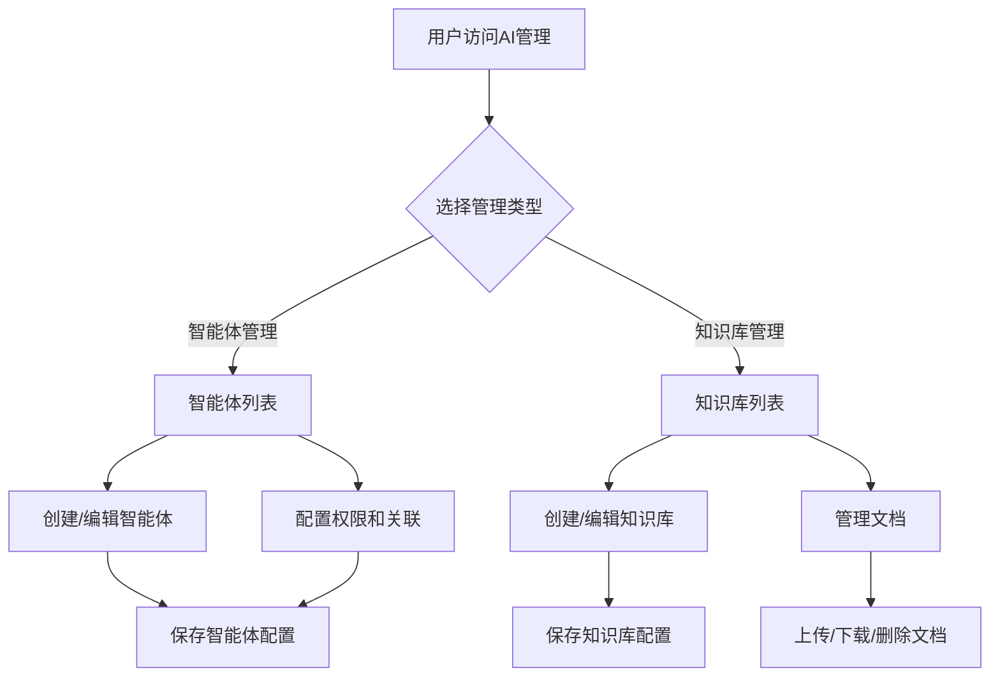
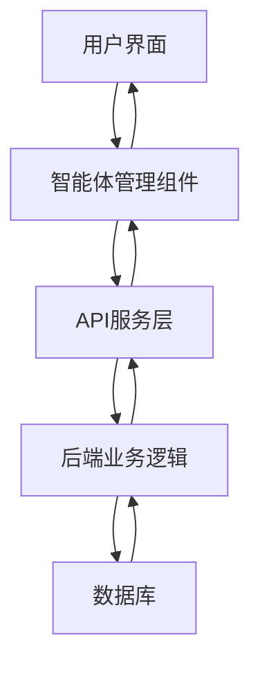
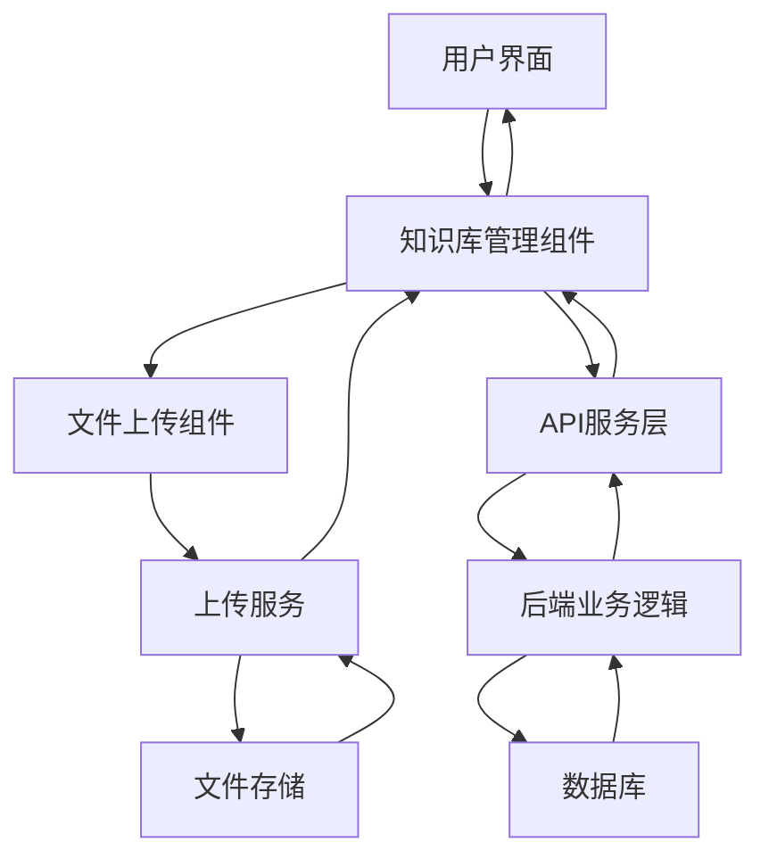
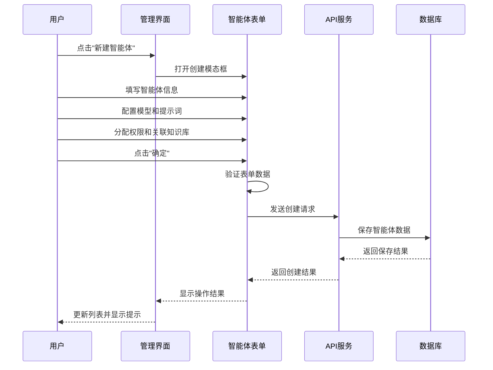
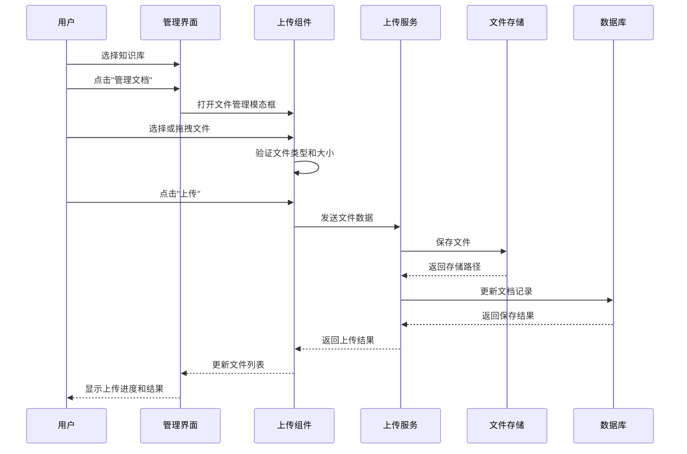

# AI管理功能设计文档

## 1. 概述

本功能设计文档详细描述了人民城轨2.0后台管理系统中AI管理功能模块的设计细节，包括功能结构、交互逻辑、数据流向等，旨在指导开发团队进行系统实现。

## 2. 功能列表

| 功能ID | 功能名称 | 功能模块 | 优先级 | 备注 |
|--------|---------|---------|--------|------|
| AI-001 | 智能体列表展示 | 智能体管理 | 高 | 表格形式展示所有智能体 |
| AI-002 | 智能体创建 | 智能体管理 | 高 | 支持模型选择、提示词配置等 |
| AI-003 | 智能体编辑 | 智能体管理 | 高 | 修改智能体各项配置 |
| AI-004 | 智能体删除 | 智能体管理 | 中 | 支持批量删除 |
| AI-005 | 智能体状态切换 | 智能体管理 | 高 | 启用/禁用智能体 |
| AI-006 | 智能体权限配置 | 智能体管理 | 高 | 按角色分配使用权限 |
| AI-007 | 智能体知识库关联 | 智能体管理 | 高 | 关联多个知识库 |
| KB-001 | 知识库列表展示 | 知识库管理 | 高 | 表格形式展示所有知识库 |
| KB-002 | 知识库创建 | 知识库管理 | 高 | 创建新的知识库 |
| KB-003 | 知识库编辑 | 知识库管理 | 高 | 修改知识库信息 |
| KB-004 | 知识库删除 | 知识库管理 | 中 | 支持批量删除，需检查关联 |
| KB-005 | 知识库状态切换 | 知识库管理 | 高 | 启用/禁用知识库 |
| KB-006 | 文档上传 | 知识库管理 | 高 | 支持多格式文档上传 |
| KB-007 | 文档列表管理 | 知识库管理 | 高 | 查看、下载、删除文档 |
| KB-008 | 知识库详情页面 | 知识库管理 | 高 | 展示知识库详情和文件列表 |
| KB-009 | 知识库详情操作 | 知识库管理 | 高 | 在详情页进行编辑、删除、状态切换 |
| AI-008 | 全局搜索 | 智能体管理、知识库管理 | 中 | 搜索智能体和知识库 |

## 3. 功能详细描述

### 3.1 智能体管理

#### 3.1.1 功能描述

智能体管理模块负责AI智能体的全生命周期管理，包括创建、配置、权限分配、状态管理等功能。

#### 3.1.2 功能结构

```
智能体管理
├── 列表展示
│   ├── 分页控制
│   ├── 搜索过滤
│   └── 批量操作
├── 智能体配置
│   ├── 基本信息（名称、描述）
│   ├── 模型配置（模型选择、参数设置）
│   ├── 提示词配置
│   └── 状态管理
└── 权限与关联
    ├── 角色权限分配
    └── 知识库关联
```

#### 3.1.3 功能字段

| 字段名 | 数据类型 | 约束 | 描述 |
|-------|---------|------|------|
| `id` | String | 必填 | 智能体唯一标识 |
| `name` | String | 必填，最大100字符 | 智能体名称 |
| `description` | Text | 必填 | 智能体简介 |
| `model` | String | 必填 | AI模型类型（如GPT-3.5, GPT-4等） |
| `prompt` | Text | 必填 | 提示词配置 |
| `maxTokens` | Number | 可选，默认4000 | 最大生成长度 |
| `temperature` | Number | 可选，默认0.7 | 生成多样性控制 |
| `topP` | Number | 可选，默认1.0 | 采样概率控制 |
| `enabled` | Boolean | 必填，默认true | 是否启用 |
| `knowledgeBases` | Array | 可选 | 关联的知识库ID列表 |
| `roles` | Array | 可选 | 有权限使用的角色ID列表 |

#### 3.1.4 交互逻辑

1. **列表展示**：
   - 表格展示所有智能体，支持分页、排序、筛选
   - 提供搜索框，支持按名称搜索
   - 支持批量选择和批量删除操作

2. **创建/编辑智能体**：
   - 点击"新建智能体"按钮打开创建模态框
   - 点击表格中的"编辑"按钮打开编辑模态框
   - 表单验证所有必填字段
   - 支持实时预览模型配置效果

3. **状态管理**：
   - 通过开关控制智能体的启用/禁用状态
   - 禁用的智能体不会在前台显示和使用

4. **权限配置**：
   - 多选框形式选择可使用的角色
   - 未选择角色时，默认仅管理员可使用

5. **知识库关联**：
   - 多选框形式选择关联的知识库
   - 智能体可关联多个知识库

### 3.2 知识库管理

#### 3.2.1 功能描述

知识库管理模块负责管理AI智能体可访问的知识库资源，支持知识库的创建、编辑、删除以及多格式文档的上传和管理。系统将知识库分为全局知识库和个人知识库两类，不同角色用户具有不同的权限。

## 3.3 AI对话聊天功能

### 3.3.1 功能描述

AI对话聊天功能允许用户与智能体进行实时对话交流，支持选择不同的智能体（如千问3、法睿），并可选择是否使用特定的知识库进行问答。用户可以创建新对话、查看历史对话记录，并进行多轮连续对话。

### 3.3.2 功能结构

AI对话聊天功能主要包含以下子功能模块：

1. **对话历史管理**：显示用户的历史对话列表，支持查看和加载历史对话
2. **智能体选择**：允许用户选择不同的智能体进行对话
3. **知识库选择**：允许用户选择是否使用特定知识库进行问答增强
4. **实时对话交互**：提供消息输入框，支持发送消息和接收智能体回复
5. **多轮对话支持**：保持对话上下文，支持连续多轮交流

### 3.3.3 功能字段

#### 3.3.3.1 智能体信息

| 字段名 | 数据类型 | 说明 | 约束 |
|-------|---------|------|------|
| id | String | 智能体唯一标识符 | 必填 |
| name | String | 智能体名称（如千问3、法睿） | 必填 |
| description | String | 智能体描述信息 | 可选 |

#### 3.3.3.2 知识库信息

| 字段名 | 数据类型 | 说明 | 约束 |
|-------|---------|------|------|
| id | String | 知识库唯一标识符 | 必填 |
| name | String | 知识库名称 | 必填 |
| isGlobal | Boolean | 是否为全局知识库 | 必填 |

#### 3.3.3.3 对话信息

| 字段名 | 数据类型 | 说明 | 约束 |
|-------|---------|------|------|
| id | String | 对话唯一标识符 | 必填 |
| title | String | 对话标题（通常为第一条消息摘要） | 必填 |
| agentName | String | 使用的智能体名称 | 必填 |
| lastMessage | String | 最后一条消息内容摘要 | 必填 |
| timestamp | String | 对话时间戳 | 必填 |

#### 3.3.3.4 消息信息

| 字段名 | 数据类型 | 说明 | 约束 |
|-------|---------|------|------|
| id | String | 消息唯一标识符 | 必填 |
| role | String | 消息角色（user/assistant） | 必填 |
| content | String | 消息内容 | 必填 |
| timestamp | String | 消息发送时间戳 | 必填 |

### 3.3.4 功能之间的逻辑关系

#### 3.3.4.1 交互效果

1. **新建对话**：点击"新建对话"按钮，清空当前聊天记录，重置为新对话状态
2. **选择智能体/知识库**：用户可以随时切换智能体或知识库，不影响当前聊天内容
3. **发送消息**：输入消息后按Enter键或点击发送按钮，消息显示在聊天区域，随后显示智能体回复
4. **历史对话**：点击左侧历史对话列表项，加载并显示对应对话的完整消息记录

#### 3.3.4.2 交互逻辑

1. **新对话创建**：用户首次发送消息时，系统自动创建对话记录，并以首条消息内容作为标题
2. **智能体调用**：系统根据用户选择的智能体和知识库配置，将用户消息发送给相应的AI服务
3. **知识库增强**：如果用户选择了知识库，系统会将知识库信息一并传递给AI服务，实现基于知识库的问答
4. **历史加载**：点击历史对话时，系统从存储中加载完整的对话消息记录并显示

### 3.3.5 权限控制逻辑

1. **普通用户权限**：
   - 可以使用所有启用的智能体进行对话
   - 可以选择自己有权限访问的知识库（包括个人知识库和有权限的全局知识库）
   - 只能查看和管理自己的对话历史

2. **管理员权限**：
   - 拥有普通用户的所有权限
   - 可以查看所有用户的知识库（用于支持和管理）

3. **超级管理员权限**：
   - 拥有全部权限，包括访问所有智能体和知识库

### 3.3.6 异常处理机制

1. **智能体调用失败**：显示友好的错误提示，建议用户重试或联系管理员
2. **知识库加载失败**：提示用户知识库暂时不可用，将以非知识库模式继续对话
3. **网络异常**：自动检测网络状态，显示离线提示，尝试重连
4. **消息发送失败**：提供重试按钮，允许用户重新发送失败的消息
5. **输入内容过长**：限制输入长度，超过时提示用户精简内容

#### 3.2.2 功能结构

```
知识库管理
├── 分类视图
│   ├── 全局知识库
│   └── 个人知识库
├── 列表展示
│   ├── 分页控制
│   ├── 搜索过滤
│   └── 批量操作
├── 知识库配置
│   ├── 基本信息（名称、描述）
│   ├── 状态管理
│   └── 权限设置（全局知识库）
├── 知识库详情
│   ├── 知识库信息展示
│   ├── 状态操作（启用/关闭）
│   ├── 编辑功能
│   └── 删除功能
└── 文件管理
    ├── 文档上传
    ├── 文件列表展示
    ├── 文件下载
    └── 文件删除
```

#### 3.2.3 功能字段

| 字段名 | 数据类型 | 约束 | 描述 |
|-------|---------|------|------|
| `id` | String | 必填 | 知识库唯一标识 |
| `name` | String | 必填，最大100字符 | 知识库名称 |
| `description` | Text | 必填 | 知识库简介 |
| `enabled` | Boolean | 必填，默认true | 是否启用 |
| `documentCount` | Number | 可选，默认0 | 文档数量统计 |
| `type` | String | 必填 | 知识库类型（faq、product、technical、operation、policy） |
| `isGlobal` | Boolean | 必填，默认false | 是否为全局知识库 |
| `owner` | String | 必填 | 知识库所有者ID |
| `roles` | Array | 可选 | 可访问该知识库的角色列表（仅全局知识库使用） |
| `userRole` | String | 必填 | 当前登录用户角色（super-admin、admin、user） |

#### 3.2.4 交互逻辑

1. **列表展示**：
   - 表格展示所有知识库，支持分页、排序、筛选
   - 提供搜索框，支持按名称搜索
   - 支持批量选择和批量删除操作

2. **创建/编辑知识库**：
   - 点击"新建全局知识库"或"新建个人知识库"按钮打开创建模态框
   - 全局知识库创建时需设置可访问的角色权限
   - 点击表格中的"编辑"按钮打开编辑模态框（根据权限显示）
   - 表单验证所有必填字段
   - 权限控制：普通用户只能创建个人知识库，管理员可创建全局和个人知识库

3. **状态管理**：
   - 通过开关控制知识库的启用/禁用状态（根据权限显示）
   - 禁用的知识库不会被智能体使用
   - 权限控制：普通用户只能修改个人知识库状态，管理员可修改所有知识库状态

4. **文档管理**：
   - 点击"管理文档"按钮打开文件管理模态框（根据权限显示）
   - 支持拖拽上传和点击上传
   - 显示文件上传进度
   - 验证文件类型和大小（支持PDF、Word、PPT、TXT，最大100MB）
   - 提供文件列表展示，支持下载和删除操作
   - 权限控制：普通用户只能管理个人知识库文档，管理员可管理所有知识库文档

5. **知识库详情**：
   - 点击知识库列表中的"查看"按钮进入知识库详情页面
   - 详情页面展示知识库基本信息和状态
   - 根据权限显示操作按钮（编辑、删除、状态切换、文档管理）
   - 删除操作前显示确认对话框
   - 详情页面以表格形式展示该知识库的所有文档文件

6. **权限控制逻辑**：
   - **超级管理员权限**：
     - 拥有全部权限
     - 可查看和管理所有全局和个人知识库
     - 可创建新的全局知识库并设置访问权限
     - 可编辑/删除所有知识库
   - **管理员权限**：
     - 可查看和管理所有全局知识库
     - 可创建新的全局知识库并设置访问权限
     - 可查看所有用户的个人知识库，但只能编辑/删除自己的个人知识库
     - 全局知识库编辑时可修改角色访问权限
   - **普通用户权限**：
     - 只能查看包含本人角色的全局知识库
     - 无法编辑或删除任何全局知识库
     - 可创建、编辑、删除自己的个人知识库

## 4. 功能之间的逻辑关系

### 4.1 交互效果

1. **智能体与知识库的关联**：
   - 创建智能体时可以选择关联已有知识库
   - 智能体可关联多个知识库
   - 知识库被删除前需检查是否有智能体关联

2. **全局与个人知识库的关系**：
   - 全局知识库由管理员创建，可设置特定角色访问权限
   - 个人知识库由用户创建，仅创建者可完全管理
   - 智能体可同时关联全局知识库和个人知识库

2. **权限控制**：
   - 智能体的使用权限基于角色分配
   - 只有被授权的角色可以在前台使用对应的智能体

3. **状态影响**：
   - 禁用智能体后，所有用户无法使用该智能体
   - 禁用知识库后，关联该知识库的智能体将无法访问其内容
   - 普通用户无法看到或访问未分配给自己角色的全局知识库

### 4.2 交互逻辑



### 4.3 成功状态

- 操作成功后显示绿色成功提示
- 表格数据自动更新，无需手动刷新
- 模态框自动关闭

### 4.4 失败状态

- 操作失败时显示红色错误提示，并展示具体错误信息
- 表单验证失败时，在对应字段下方显示错误提示
- 文件上传失败时，显示上传错误原因

### 4.5 异常状态

- 网络异常时，提供重试机制
- 服务器错误时，记录详细错误日志，向用户显示友好提示
- 权限不足时，禁止访问相关功能并提示用户
- 尝试访问无权限的全局知识库时，给出明确的权限提示

## 5. 数据流向图

### 5.1 智能体数据流



### 5.2 知识库数据流



## 6. 业务流程图

### 6.1 智能体创建流程



### 6.2 知识库文档上传流程



## 7. 异常处理机制

### 7.1 前端异常处理

1. **表单验证**：
   - 实时验证用户输入，提供即时反馈
   - 提交前进行全量验证，确保数据完整性

2. **网络请求错误**：
   - 捕获API请求异常，显示友好错误提示
   - 提供重试机制，支持用户手动重试

3. **文件上传错误**：
   - 验证文件类型和大小，防止无效上传
   - 显示详细的上传错误信息
   - 支持断点续传（后续优化）

4. **组件渲染错误**：
   - 使用错误边界组件捕获渲染异常
   - 显示兜底UI，避免整个页面崩溃

### 7.2 后端异常处理

1. **业务逻辑错误**：
   - 捕获并记录所有业务逻辑异常
   - 返回标准化的错误码和错误信息

2. **数据验证错误**：
   - 服务端再次验证所有请求参数
   - 返回详细的字段验证错误信息

3. **数据库错误**：
   - 事务管理确保数据一致性
   - 记录详细的数据库操作日志

4. **安全相关错误**：
   - 捕获权限验证失败、敏感操作等安全事件
   - 记录安全日志，便于审计和问题排查
   - 超级管理员拥有全部权限，不进行权限过滤
   - 当系统无法正确识别用户角色时，默认以普通用户权限运行，并记录异常日志以便排查

## 8. 技术实现说明

### 8.1 前端实现

- **组件化开发**：使用React组件化思想，将UI拆分为独立可复用的组件
- **状态管理**：使用React内置状态管理和Context API管理组件状态
- **API交互**：使用Axios进行HTTP请求，统一处理请求拦截和响应拦截
- **UI组件**：使用Ant Design组件库构建用户界面
- **图标库**：使用FontAwesome提供丰富的图标支持

### 8.2 特殊技术处理

#### 8.2.1 JSX语法兼容性解决方案

由于项目使用原生JavaScript技术栈，为确保兼容性，所有组件使用React.createElement()替代JSX语法：

```javascript
// 原JSX语法：
// <Button type="primary" onClick={handleCreate}>新建智能体</Button>

// 转换后的React.createElement()调用：
React.createElement(
  Button,
  {
    type: 'primary',
    onClick: handleCreate
  },
  '新建智能体'
)
```

这种转换确保了代码与现有技术栈的兼容性，同时保持了功能的完整性。

#### 8.2.2 文件上传优化

- 使用分片上传技术处理大文件（后续优化）
- 实现文件上传进度显示
- 添加文件上传队列管理
- 支持拖拽上传和多选上传

## 9. 性能优化考虑

1. **数据加载优化**：
   - 实现表格虚拟滚动，提高大数据量下的渲染性能
   - 使用分页加载，减少一次性数据传输量

2. **组件渲染优化**：
   - 使用React.memo避免不必要的组件重渲染
   - 优化组件结构，减少嵌套层级

3. **请求优化**：
   - 使用防抖、节流技术减少不必要的API请求
   - 实现数据缓存，减少重复请求

## 10. 版本历史

| 日期 | 版本 | 更新内容 | 更新人 |
|------|------|---------|--------|
| 2024-01-21 | V1.1 | 优化前端实现，使用原生JavaScript和React.createElement()替代JSX语法 | 开发团队 |
| 2024-01-20 | V1.0 | 初始版本，完成功能设计文档编写 | 产品团队 |