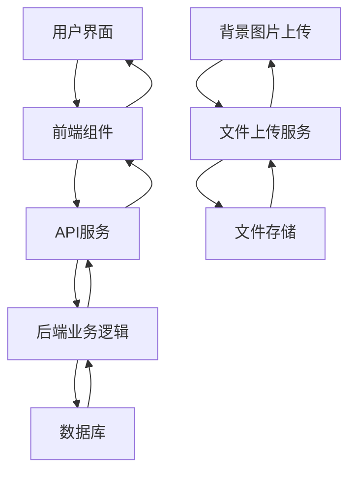
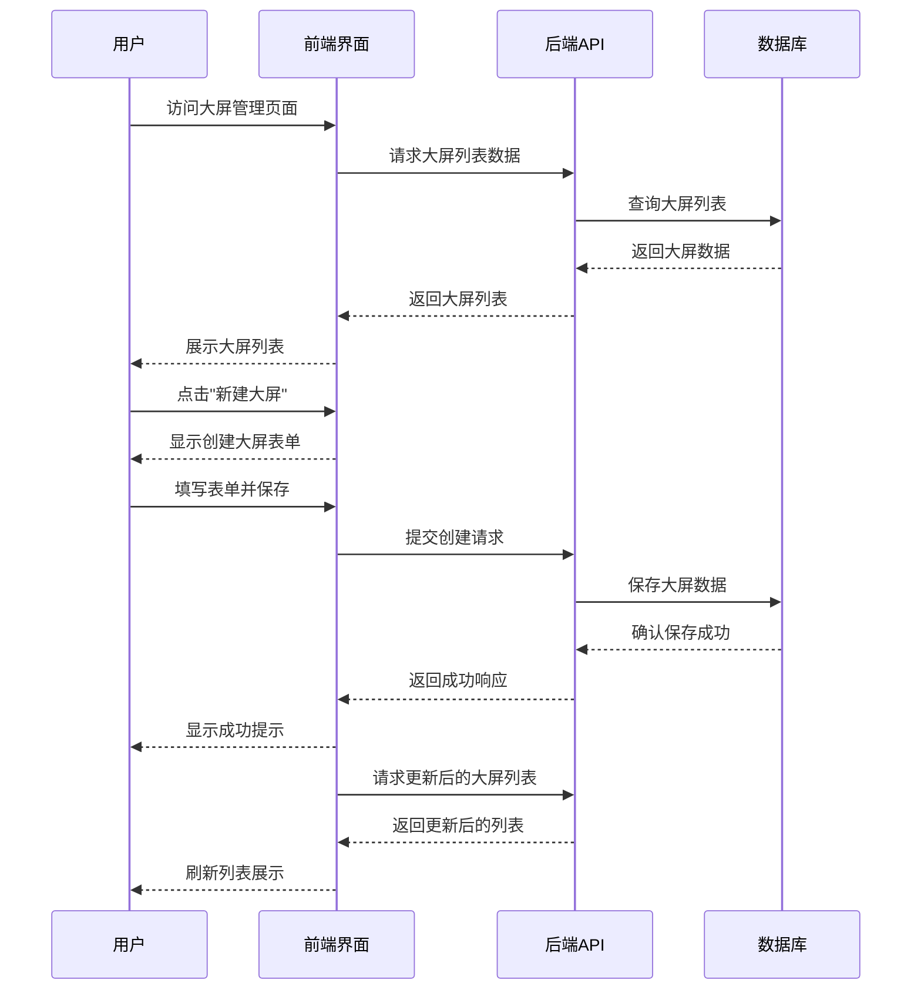
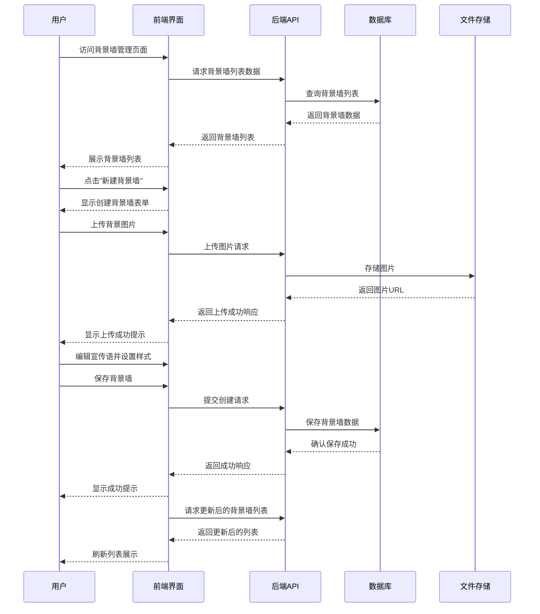

# 大屏运营功能设计文档

## 1. 概述

本功能设计文档详细描述了人民城轨2.0后台管理系统中大屏运营功能模块的设计细节，包括功能结构、交互逻辑、数据流向等，旨在指导开发团队进行系统实现。本模块包含大屏管理和背景墙管理两个核心子功能。

## 2. 功能列表

| 功能ID | 功能名称 | 功能模块 | 优先级 | 备注 |
|--------|---------|---------|--------|------|
| SO-001 | 大屏列表展示 | 大屏管理 | 高 | 表格形式展示所有大屏配置 |
| SO-002 | 大屏创建 | 大屏管理 | 高 | 创建新的大屏配置 |
| SO-003 | 大屏编辑 | 大屏管理 | 高 | 修改大屏各项配置 |
| SO-004 | 大屏删除 | 大屏管理 | 中 | 支持批量删除 |
| SO-005 | 大屏预览 | 大屏管理 | 高 | 预览大屏显示效果 |
| SO-006 | 大屏状态切换 | 大屏管理 | 高 | 启用/禁用大屏 |
| SO-007 | 大屏内容配置 | 大屏管理 | 高 | 配置大屏各模块内容 |
| BW-001 | 背景墙列表展示 | 背景墙管理 | 高 | 表格形式展示所有背景墙 |
| BW-002 | 背景墙创建 | 背景墙管理 | 高 | 创建新的背景墙 |
| BW-003 | 背景墙编辑 | 背景墙管理 | 高 | 修改背景墙信息 |
| BW-004 | 背景墙删除 | 背景墙管理 | 中 | 支持批量删除 |
| BW-005 | 背景墙预览 | 背景墙管理 | 高 | 预览背景墙显示效果 |
| BW-006 | 背景墙状态切换 | 背景墙管理 | 高 | 启用/禁用背景墙 |
| BW-007 | 背景图片上传 | 背景墙管理 | 高 | 上传背景图片 |
| BW-008 | 宣传语编辑 | 背景墙管理 | 高 | 使用富文本编辑宣传语 |
| BW-009 | 文字样式调整 | 背景墙管理 | 高 | 调整文字字体、颜色、描边等 |
| BW-010 | 文字位置调整 | 背景墙管理 | 高 | 调整文字对齐方式（左对齐、居中、右对齐） |

## 3. 功能详细描述

### 3.1 大屏管理

#### 3.1.1 功能描述

大屏管理模块负责大屏内容的配置和管理，支持大屏的创建、编辑、删除、预览和状态管理等功能。系统提供多种大屏模板供用户选择，并支持自定义配置各个模块的内容。

#### 3.1.2 功能结构

```
大屏管理
├── 列表展示
│   ├── 分页控制
│   ├── 搜索过滤
│   └── 批量操作
├── 大屏配置
│   ├── 基本信息（名称、描述）
│   ├── 大屏模板选择
│   ├── 模块内容配置
│   └── 状态管理
└── 操作功能
    ├── 创建大屏
    ├── 编辑大屏
    ├── 删除大屏
    └── 预览大屏
```

#### 3.1.3 功能字段

| 字段名 | 数据类型 | 约束 | 描述 |
|-------|---------|------|------|
| `id` | String | 必填 | 大屏唯一标识 |
| `name` | String | 必填，最大100字符 | 大屏名称 |
| `description` | Text | 必填 | 大屏简介 |
| `templateId` | String | 必填 | 大屏模板ID |
| `config` | Object | 必填 | 大屏配置对象，包含各模块配置 |
| `enabled` | Boolean | 必填，默认true | 是否启用 |
| `createTime` | DateTime | 必填 | 创建时间 |
| `updateTime` | DateTime | 必填 | 更新时间 |

#### 3.1.4 交互逻辑

1. **列表展示**：
   - 表格展示所有大屏配置，支持分页、排序、筛选
   - 提供搜索框，支持按名称搜索
   - 支持批量选择和批量删除操作

2. **创建/编辑大屏**：
   - 点击"新建大屏"按钮打开创建模态框
   - 点击表格中的"编辑"按钮打开编辑模态框
   - 表单验证所有必填字段
   - 支持大屏模板选择

3. **预览大屏**：
   - 点击"预览"按钮在新窗口打开大屏预览页面
   - 预览页面显示大屏的实际效果

4. **状态管理**：
   - 通过开关控制大屏的启用/禁用状态
   - 禁用的大屏不会在前台显示

### 3.2 背景墙管理

#### 3.2.1 功能描述

背景墙管理模块允许用户上传背景图片并添加宣传语，支持图片上传、宣传语编辑、文字样式和位置调整等功能。背景墙主要用于展示纯背景图片配合宣传语，尺寸与大屏尺寸一致。

#### 3.2.2 功能结构

```
背景墙管理
├── 列表展示
│   ├── 分页控制
│   ├── 搜索过滤
│   └── 批量操作
├── 背景墙配置
│   ├── 基本信息（名称、描述）
│   ├── 背景图片上传
│   ├── 宣传语编辑
│   ├── 文字样式设置
│   └── 状态管理
└── 操作功能
    ├── 创建背景墙
    ├── 编辑背景墙
    ├── 删除背景墙
    └── 预览背景墙
```

#### 3.2.3 功能字段

| 字段名 | 数据类型 | 约束 | 描述 |
|-------|---------|------|------|
| `id` | String | 必填 | 背景墙唯一标识 |
| `name` | String | 必填，最大100字符 | 背景墙名称 |
| `description` | Text | 必填 | 背景墙简介 |
| `backgroundImage` | String | 必填 | 背景图片URL |
| `content` | String | 必填 | 宣传语内容（富文本） |
| `textStyle` | Object | 必填 | 文字样式设置（字体、大小、颜色等） |
| `textAlign` | String | 必填，默认'center' | 文字对齐方式（left/center/right） |
| `enabled` | Boolean | 必填，默认true | 是否启用 |
| `createTime` | DateTime | 必填 | 创建时间 |
| `updateTime` | DateTime | 必填 | 更新时间 |

#### 3.2.4 交互逻辑

1. **列表展示**：
   - 表格展示所有背景墙，支持分页、排序、筛选
   - 提供搜索框，支持按名称搜索
   - 支持批量选择和批量删除操作

2. **创建/编辑背景墙**：
   - 点击"新建背景墙"按钮打开创建模态框
   - 点击表格中的"编辑"按钮打开编辑模态框
   - 表单验证所有必填字段

3. **背景图片上传**：
   - 支持拖拽上传和点击上传
   - 显示上传进度和缩略图
   - 限制图片格式和大小

4. **宣传语编辑**：
   - 提供富文本编辑器
   - 支持文字样式实时预览
   - 支持文字对齐方式调整（左对齐、居中、右对齐）

5. **预览背景墙**：
   - 点击"预览"按钮在新窗口打开背景墙预览页面
   - 预览页面显示背景墙的实际效果

6. **状态管理**：
   - 通过开关控制背景墙的启用/禁用状态
   - 禁用的背景墙不会在前台显示

## 4. 功能之间的逻辑关系

### 4.1 交互效果

1. **大屏管理与背景墙管理**：
   - 两者作为大屏运营模块下的平级子功能，共享相似的列表展示、CRUD操作和状态管理逻辑
   - 大屏管理专注于复杂的多模块内容配置，背景墙管理专注于背景图片和宣传语的简单配置

2. **创建/编辑流程**：
   - 点击创建/编辑按钮 → 打开模态框 → 填写表单 → 保存 → 关闭模态框 → 刷新列表

3. **删除流程**：
   - 选择记录 → 点击删除按钮 → 确认对话框 → 确认删除 → 刷新列表

### 4.2 成功状态

- 操作成功后显示成功提示信息
- 列表数据实时更新
- 表单数据保存成功

### 4.3 失败状态

- 操作失败后显示错误提示信息
- 表单验证失败时显示具体错误提示
- 网络错误时提供重试选项

### 4.4 异常状态

| 异常类型 | 处理方式 | 提示信息 |
|---------|---------|--------|
| 权限不足 | 拦截操作 | "您没有权限执行此操作" |
| 数据重复 | 阻止保存 | "名称已存在，请更换" |
| 上传失败 | 显示错误 | "图片上传失败，请重试" |
| 格式错误 | 表单验证 | "请输入有效的数据格式" |

## 5. 数据流向图



## 6. 业务流程图

### 6.1 大屏管理业务流程



### 6.2 背景墙管理业务流程



## 7. 异常处理机制

### 7.1 异常类型处理方式

| 异常类型 | 处理方式 | 响应状态码 | 错误提示 |
|---------|---------|-----------|--------|
| 参数验证失败 | 直接返回错误信息 | 400 Bad Request | 具体的参数错误信息 |
| 权限不足 | 拦截操作，返回403 | 403 Forbidden | "您没有权限执行此操作" |
| 资源不存在 | 返回404 | 404 Not Found | "请求的资源不存在" |
| 服务器错误 | 记录错误日志，返回500 | 500 Internal Server Error | "服务器内部错误，请稍后重试" |
| 数据库操作异常 | 事务回滚，记录错误日志 | 500 Internal Server Error | "数据库操作失败" |
| 文件上传失败 | 清理临时文件，返回错误信息 | 400 Bad Request | "文件上传失败，请检查文件格式和大小" |

### 7.2 日志记录

- 系统操作日志：记录用户的关键操作，包括登录、创建、编辑、删除等
- 错误日志：记录系统运行过程中的错误信息，包括异常类型、发生时间、错误堆栈等
- 性能日志：记录关键API的响应时间和资源消耗情况

### 7.3 容错机制

- 表单提交前进行客户端验证，减少无效请求
- 服务端接口进行参数校验和业务逻辑校验
- 数据库操作使用事务，确保数据一致性
- 文件上传采用分块上传和断点续传机制
- 提供操作重试机制和错误提示

## 8. 性能要求

### 8.1 响应时间

- 页面加载时间：≤ 3秒
- API响应时间：≤ 500毫秒
- 文件上传速度：视网络情况而定，提供进度提示

### 8.2 并发支持

- 支持5000用户同时在线
- 支持1000用户并发操作

### 8.3 数据刷新

- 列表数据支持手动刷新
- 支持定时自动刷新（可配置刷新间隔）

## 9. 安全要求

### 9.1 RBAC权限控制

- 基于角色的访问控制，不同角色拥有不同的操作权限
- 支持精细化的权限配置，可控制到具体功能和数据

### 9.2 数据加密

- 敏感数据传输采用HTTPS加密
- 存储的数据进行适当加密处理

### 9.3 操作审计

- 记录所有关键操作的审计日志
- 支持操作日志查询和追溯

## 10. 可扩展性要求

### 10.1 模块化设计

- 功能模块独立，便于扩展和维护
- 支持插件式开发

### 10.2 接口标准化

- 提供标准化的API接口，便于集成和扩展
- 接口设计遵循RESTful规范

### 10.3 插件支持

- 支持自定义插件开发和集成
- 提供插件管理机制

## 11. 版本历史

| 日期 | 版本 | 变更内容 | 变更人 |
|------|------|---------|--------|
| 2024-05-20 | V1.1 | 新增背景墙管理功能，调整功能架构，将大屏管理作为二级功能 | 产品团队 |
| 2024-05-16 | V1.0 | 初始版本，包含大屏管理功能 | 产品团队 |