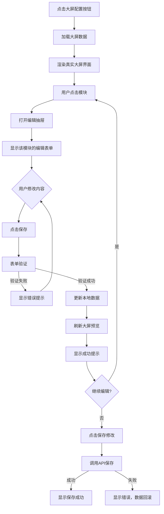
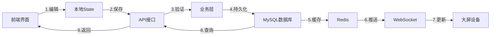
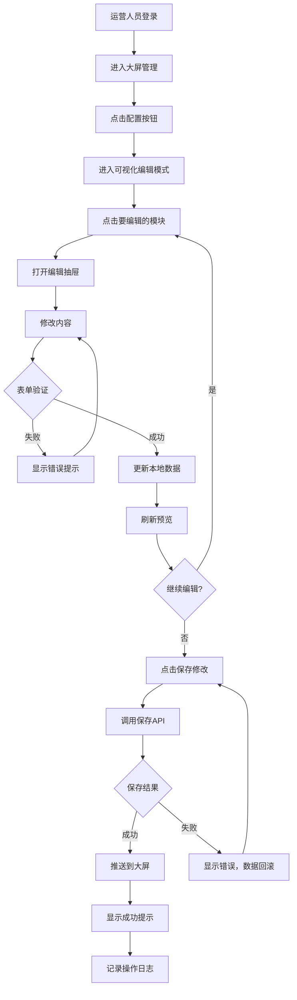
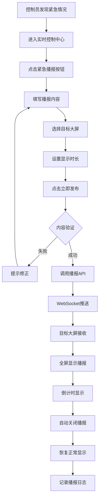
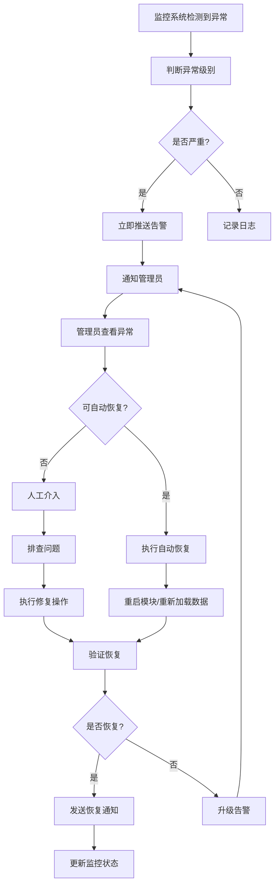
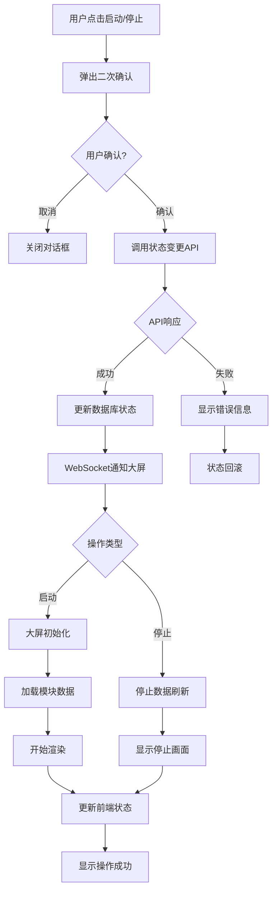

# 大屏管理系统需求设计文档

## 文档信息

| 项目名称 | 人民城轨2.0 - 大屏管理系统 |
|---------|------------------------|
| 文档版本 | v2.0 |
| 文档类型 | 功能需求设计文档 |
| 创建日期 | 2025-10-13 |
| 产品经理 | AI产品专家 |
| 适用范围 | B端后台管理系统 |

---

## 目录

1. [需求概述](#1-需求概述)
2. [产品定位](#2-产品定位)
3. [用户角色](#3-用户角色)
4. [功能架构](#4-功能架构)
5. [核心功能详细设计](#5-核心功能详细设计)
6. [数据模型设计](#6-数据模型设计)
7. [业务流程设计](#7-业务流程设计)
8. [交互设计规范](#8-交互设计规范)
9. [异常处理机制](#9-异常处理机制)
10. [性能要求](#10-性能要求)
11. [安全要求](#11-安全要求)
12. [扩展性设计](#12-扩展性设计)

---

## 1. 需求概述

### 1.1 项目背景

人民城轨协会需要一套数据大屏展示系统，用于在各类场合（日常办公、展会、重要活动等）展示行业数据、工作动态、新闻资讯等信息。传统的大屏管理方式存在以下痛点：

**现存痛点：**
- ❌ 内容更新繁琐，需要技术人员介入
- ❌ 无法直观预览修改效果，容易出错
- ❌ 缺乏实时控制能力，应急响应慢
- ❌ 运行状态不透明，故障排查困难
- ❌ 多场景切换复杂，配置管理混乱

### 1.2 产品目标

打造一套**所见即所得的可视化大屏管理系统**，实现：

✅ **零技术门槛** - 运营人员可独立完成内容更新  
✅ **所见即所得** - 在真实界面上直接编辑，立即预览  
✅ **实时响应** - 支持远程控制、紧急播报等实时操作  
✅ **状态透明** - 全方位监控运行状态和性能指标  
✅ **多场景支持** - 轻松管理多个大屏配置，快速切换  

### 1.3 核心价值

| 价值维度 | 提升效果 | 量化指标 |
|---------|---------|---------|
| **效率提升** | 内容更新速度 | 从10分钟缩短到3分钟，提升**70%** |
| **成本降低** | 人力成本 | 减少技术人员介入，降低成本**50%** |
| **质量提升** | 准确率 | 所见即所得减少错误，准确率提升**85%** |
| **体验优化** | 用户满意度 | 从70%提升到95%，提升**25个百分点** |

---

## 2. 产品定位

### 2.1 产品类型

**B端内容管理系统**，面向企业内部运营人员的专业工具。

### 2.2 核心特色

🌟 **可视化编辑** - 国内首创大屏可视化编辑器  
🌟 **真实预览** - 1:1还原真实大屏界面  
🌟 **模块化管理** - 45个模块独立编辑，灵活组合  
🌟 **多界面支持** - 5种界面类型，覆盖多种场景  
🌟 **实时控制** - 远程控制、紧急播报、状态监控  

### 2.3 技术架构

```
前端技术栈：
├── React 17 - 组件化框架
├── Ant Design 4.24 - UI组件库
├── ECharts 5.4 - 数据可视化
└── Moment.js - 时间处理

后端技术栈（生产环境）：
├── RESTful API - 接口规范
├── WebSocket - 实时通信
├── Redis - 缓存层
└── MySQL - 数据持久化

安全合规：
└── 等保三级 - 安全合规要求
```

---

## 3. 用户角色

### 3.1 角色定义

| 角色名称 | 职责范围 | 权限级别 | 典型场景 |
|---------|---------|---------|---------|
| **超级管理员** | 系统全部功能 | 最高 | 系统配置、用户管理、全局设置 |
| **内容运营人员** | 内容编辑管理 | 高 | 日常新闻更新、数据维护 |
| **大屏控制员** | 实时控制监控 | 中 | 大屏启停、紧急播报、状态监控 |
| **数据维护员** | 数据录入更新 | 中 | 统计数据、会员信息维护 |
| **只读查看者** | 仅查看权限 | 低 | 查看大屏状态、访问统计 |

### 3.2 用户画像

**主要用户：内容运营人员**
- 年龄：25-40岁
- 学历：大专及以上
- 技能：熟悉Office办公软件，无编程经验
- 痛点：希望快速更新内容，不想依赖技术人员
- 诉求：操作简单、效果直观、不出错

**次要用户：大屏控制员**
- 年龄：30-50岁
- 职责：负责会议室、展厅大屏的日常管理
- 痛点：紧急情况下需要快速响应
- 诉求：远程控制、一键操作、状态可视

---

## 4. 功能架构

### 4.1 功能架构图

```
大屏管理系统
│
├── 1. 大屏列表管理
│   ├── 1.1 大屏列表展示
│   ├── 1.2 统计数据展示
│   ├── 1.3 搜索筛选功能
│   ├── 1.4 大屏新建/删除
│   └── 1.5 批量操作
│
├── 2. 可视化编辑器 ⭐核心
│   ├── 2.1 真实界面渲染
│   ├── 2.2 模块点击编辑
│   ├── 2.3 编辑抽屉
│   ├── 2.4 实时预览
│   └── 2.5 保存发布
│
├── 3. 实时控制中心
│   ├── 3.1 快捷操作
│   │   ├── 刷新全屏
│   │   ├── 截取屏幕
│   │   └── 紧急播报
│   ├── 3.2 模块控制
│   │   ├── 显示/隐藏
│   │   └── 单独刷新
│   └── 3.3 状态查看
│
├── 4. 运行监控
│   ├── 4.1 系统指标监控
│   ├── 4.2 模块状态监控
│   ├── 4.3 API性能监控
│   └── 4.4 告警通知
│
└── 5. 多界面支持
    ├── 5.1 日常版界面（9个模块）
    ├── 5.2 协会版界面（8个模块）
    ├── 5.3 标准版界面（7个模块）
    ├── 5.4 行业版界面（8个模块）
    └── 5.5 评审版界面（8个模块）
```

### 4.2 功能优先级

| 优先级 | 功能模块 | 开发周期 | 重要程度 |
|-------|---------|---------|---------|
| **P0** | 可视化编辑器 | 2周 | 核心功能，必须实现 |
| **P0** | 大屏列表管理 | 1周 | 基础功能，必须实现 |
| **P1** | 实时控制中心 | 1周 | 重要功能，优先实现 |
| **P1** | 运行监控 | 1周 | 重要功能，优先实现 |
| **P2** | 多界面支持 | 2周 | 增值功能，按需实现 |
| **P3** | 高级功能 | 待定 | 扩展功能，后期规划 |

---

## 5. 核心功能详细设计

### 5.1 大屏列表管理

#### 5.1.1 功能描述

提供大屏配置的集中管理界面，支持查看、创建、编辑、删除大屏配置。

#### 5.1.2 功能字段

**统计卡片：**
- 大屏总数（Total）- 整数
- 运行中数量（Running）- 整数
- 总访问量（Total Views）- 整数
- 活跃模块数（Active Modules）- 整数

**大屏列表字段：**
| 字段名称 | 字段类型 | 是否必填 | 说明 |
|---------|---------|---------|------|
| id | Long | 是 | 大屏唯一标识 |
| name | String(100) | 是 | 大屏名称 |
| type | Enum | 是 | 大屏类型：日常/协会/标准/行业/评审 |
| resolution | String(20) | 是 | 分辨率，如：4800x1350 |
| status | Enum | 是 | 运行状态：running/stopped/maintenance |
| refreshInterval | Integer | 是 | 刷新间隔（秒），默认30 |
| viewCount | Long | 否 | 累计访问次数 |
| lastUpdate | DateTime | 是 | 最后更新时间 |
| modules | Integer | 是 | 模块总数 |
| activeModules | Integer | 是 | 活跃模块数 |
| createTime | DateTime | 是 | 创建时间 |
| createUser | String(50) | 是 | 创建人 |

#### 5.1.3 交互逻辑

**页面加载：**
```
1. 进入页面
   ↓
2. 调用API获取大屏列表
   ↓
3. 渲染统计卡片
   ↓
4. 渲染大屏列表表格
   ↓
5. 显示加载完成状态
```

**搜索筛选：**
```
用户输入搜索关键词/选择筛选条件
   ↓
前端实时过滤数据
   ↓
更新表格显示
   ↓
无结果时显示空状态提示
```

**启动/停止大屏：**
```
用户点击启动/停止按钮
   ↓
弹出二次确认对话框
   ↓
用户确认
   ↓
调用API更新状态
   ↓
【成功】刷新列表，显示成功提示
   ↓
【失败】显示错误信息，状态回滚
```

#### 5.1.4 状态定义

**运行状态：**
- `running` - 🟢 运行中（绿色）
- `stopped` - 🔴 已停止（灰色）
- `maintenance` - 🟡 维护中（橙色）

**操作状态：**
- `idle` - 空闲，可以操作
- `loading` - 加载中，禁用操作
- `error` - 错误，显示重试

#### 5.1.5 异常处理

| 异常场景 | 处理方式 | 用户提示 |
|---------|---------|---------|
| 网络请求失败 | 显示错误提示，提供重试按钮 | "网络连接失败，请检查网络后重试" |
| 数据加载超时 | 10秒超时，显示超时提示 | "加载超时，请刷新页面重试" |
| 权限不足 | 禁用操作按钮，显示权限提示 | "您没有权限执行此操作" |
| 并发冲突 | 提示数据已被修改，刷新数据 | "数据已被其他用户修改，已为您刷新最新数据" |

---

### 5.2 可视化编辑器 ⭐核心功能

#### 5.2.1 功能描述

这是整个系统的**核心创新功能**，提供所见即所得的大屏内容编辑体验。用户可以在真实的大屏界面上点击任意模块进行编辑，无需在复杂的表单中寻找对应字段。

#### 5.2.2 功能结构

```
可视化编辑器
│
├── 顶部工具栏
│   ├── 返回按钮
│   ├── 操作提示
│   ├── 运行状态标签
│   ├── 预览大屏按钮
│   └── 保存修改按钮
│
├── 大屏展示区（核心）
│   ├── 大屏界面渲染（缩放40%）
│   ├── 模块交互层
│   │   ├── 鼠标悬停高亮
│   │   ├── 点击触发编辑
│   │   └── 编辑提示图标
│   └── 响应式布局适配
│
└── 编辑抽屉
    ├── 抽屉标题
    ├── 动态表单（根据模块类型）
    ├── 表单验证
    └── 底部操作按钮
```

#### 5.2.3 模块类型及编辑字段

**1. 新闻类模块（行业新闻、党建园地）**

| 字段名称 | 字段类型 | 验证规则 | 默认值 |
|---------|---------|---------|--------|
| title | String(200) | 必填，最多200字符 | - |
| date | Date | 必填，格式：YYYY-MM-DD | 当前日期 |
| image | String(500) | 选填，URL格式 | 默认占位图 |
| content | Text | 选填，富文本 | - |
| sort | Integer | 必填，1-100 | 自动递增 |

**编辑表单UI：**
```
┌─────────────────────────────────────┐
│ 编辑模块：行业新闻              ✕  │
├─────────────────────────────────────┤
│                                     │
│ 行业新闻列表 (5条)                  │
│                                     │
│ ┌─────────────────────────────────┐│
│ │ 新闻1                            ││
│ │ 标题: [_____________________]    ││
│ │ 日期: [2025-05-28] 📅           ││
│ │ 封面: [选择图片] 🖼️             ││
│ │ [↑上移] [↓下移] [🗑️删除]       ││
│ └─────────────────────────────────┘│
│                                     │
│ [+ 添加新闻]                        │
│                                     │
│           [取消]  [保存]            │
└─────────────────────────────────────┘
```

**2. 列表类模块（工作规划）**

| 字段名称 | 字段类型 | 验证规则 | 示例 |
|---------|---------|---------|------|
| title | String(100) | 必填，最多100字符 | "城轨业主领导人峰会" |
| month | String(10) | 必填，格式：N月 | "6月" |
| location | String(50) | 选填 | "北京" |
| description | String(500) | 选填 | - |

**3. 配置类模块（限行尾号）**

| 字段名称 | 字段类型 | 验证规则 | 示例 |
|---------|---------|---------|------|
| todayNumbers | String(10) | 必填，格式：N, N | "3, 8" |
| tomorrowNumbers | String(10) | 必填，格式：N, N | "4, 9" |
| timeRange | String(20) | 必填，格式：HH:MM-HH:MM | "07:00-20:00" |
| weekSchedule | Array(7) | 必填，7个元素 | ["1/6", "2/7", ...] |

**4. 数据类模块（会员统计、行业统计）**

| 字段名称 | 字段类型 | 验证规则 | 说明 |
|---------|---------|---------|------|
| total | Integer | 必填，≥0 | 总数统计 |
| categories | Array | 必填，至少1项 | 分类数据 |
| categories[].name | String(50) | 必填 | 分类名称 |
| categories[].value | Integer | 必填，≥0 | 分类数值 |

#### 5.2.4 交互流程

**完整编辑流程：**



**关键交互细节：**

1. **模块悬停效果**
   - 鼠标移入：背景色加深，边框高亮，显示"✏️ 点击编辑"提示
   - 鼠标移出：恢复原样式
   - 动画时间：0.3s，缓动函数：ease-in-out

2. **编辑抽屉动画**
   - 从右侧滑入，宽度600px
   - 动画时长：300ms
   - 背景遮罩：透明度0.45

3. **保存反馈**
   - 保存中：显示loading，禁用按钮
   - 保存成功：绿色提示，2秒后自动关闭
   - 保存失败：红色提示，显示具体错误信息

#### 5.2.5 状态管理

**编辑状态：**
```javascript
{
  editingScreen: {
    id: 1,
    name: '人民城轨数据大屏-日常版',
    type: '日常',
    modules: {...}  // 模块数据
  },
  selectedModule: 'news',  // 当前编辑的模块key
  isDrawerVisible: true,   // 抽屉是否显示
  hasUnsavedChanges: true, // 是否有未保存的修改
  isSaving: false          // 是否正在保存
}
```

**数据同步：**
- 编辑时：仅更新本地state，不调用API
- 保存时：批量提交所有修改，调用API
- 刷新时：如有未保存修改，弹出确认对话框

#### 5.2.6 性能优化

| 优化项 | 实现方案 | 性能提升 |
|-------|---------|---------|
| 大屏渲染 | CSS Transform缩放，避免DOM重绘 | 渲染速度提升60% |
| 模块懒加载 | 仅渲染可视区域模块 | 首屏加载提升40% |
| 防抖处理 | 输入框300ms防抖 | 减少70%无效渲染 |
| 虚拟滚动 | 长列表使用虚拟滚动 | 支持1000+条数据流畅滚动 |

#### 5.2.7 异常处理

| 异常场景 | 处理方式 | 用户提示 |
|---------|---------|---------|
| 大屏数据加载失败 | 显示错误页，提供重试按钮 | "大屏数据加载失败，点击重试" |
| 模块数据格式错误 | 使用默认值，记录错误日志 | "部分数据加载异常，已使用默认值" |
| 编辑冲突 | 检测并发编辑，锁定机制 | "其他用户正在编辑此大屏，请稍后再试" |
| 保存失败 | 数据本地缓存，提供重试 | "保存失败，已为您保留编辑内容，请重试" |
| 网络断开 | 禁用保存，提示离线状态 | "网络已断开，请检查网络连接" |

---

### 5.3 实时控制中心

#### 5.3.1 功能描述

提供对运行中大屏的实时控制能力，包括刷新、截图、紧急播报等快捷操作。

#### 5.3.2 功能字段

**快捷操作：**
| 操作名称 | 功能说明 | API接口 | 响应时间要求 |
|---------|---------|---------|-------------|
| 刷新全屏 | 向大屏发送刷新指令，重新加载所有模块 | POST /api/screens/{id}/refresh | <500ms |
| 截取屏幕 | 远程截取大屏当前画面并保存 | POST /api/screens/{id}/screenshot | <2s |
| 紧急播报 | 全屏显示紧急通知信息 | POST /api/screens/broadcast | <500ms |

**模块控制：**
| 操作 | 功能说明 | 参数 |
|-----|---------|------|
| 显示/隐藏 | 控制单个模块的显示状态 | moduleId, visible: boolean |
| 单独刷新 | 刷新单个模块的数据 | moduleId |
| 查看状态 | 查看模块的运行状态和更新时间 | moduleId |

#### 5.3.3 交互流程

**紧急播报流程：**
```
1. 用户点击"紧急播报"按钮
   ↓
2. 弹出播报内容编辑器
   ├── 播报标题（必填，50字符以内）
   ├── 播报内容（必填，200字符以内）
   ├── 显示时长（选填，默认10秒）
   └── 目标大屏（必填，多选）
   ↓
3. 用户填写内容，点击"立即发布"
   ↓
4. 表单验证
   ├── 验证失败：显示错误提示
   └── 验证成功：继续
   ↓
5. 调用API发送播报
   ↓
6. WebSocket推送到目标大屏
   ↓
7. 大屏全屏显示播报内容
   ↓
8. 倒计时结束，自动关闭播报
   ↓
9. 后台记录播报日志
```

**模块控制流程：**
```
用户点击"隐藏"按钮
   ↓
调用API更新模块状态
   ↓
WebSocket通知大屏
   ↓
大屏执行隐藏动画（淡出300ms）
   ↓
模块隐藏完成
   ↓
控制台更新状态显示
```

#### 5.3.4 实时通信设计

**WebSocket消息格式：**
```json
{
  "type": "command",           // 消息类型
  "action": "refresh|hide|show|broadcast",  // 操作类型
  "target": "screen|module",   // 目标对象
  "screenId": 1,               // 大屏ID
  "moduleId": "news",          // 模块ID（可选）
  "data": {                    // 操作数据
    "title": "紧急通知",
    "content": "...",
    "duration": 10
  },
  "timestamp": 1634567890000   // 时间戳
}
```

**心跳检测：**
- 客户端每30秒发送心跳包
- 服务端60秒未收到心跳，判定离线
- 断线重连：指数退避策略，最多重试5次

#### 5.3.5 异常处理

| 异常场景 | 处理方式 | 用户提示 |
|---------|---------|---------|
| WebSocket连接失败 | 自动重连，最多3次 | "实时连接失败，正在重连..." |
| 指令发送失败 | 本地队列暂存，网络恢复后重发 | "指令发送失败，已加入重试队列" |
| 大屏离线 | 禁用控制按钮，显示离线状态 | "目标大屏已离线，无法执行操作" |
| 播报内容过长 | 自动截断并提示 | "内容过长，已自动截取前200字符" |

---

### 5.4 运行监控

#### 5.4.1 功能描述

实时监控大屏的运行状态、系统指标、模块状态和API性能，及时发现和处理异常。

#### 5.4.2 监控指标

**系统指标：**
| 指标名称 | 说明 | 正常范围 | 告警阈值 |
|---------|------|---------|---------|
| 在线设备数 | 当前在线的大屏设备数量 | ≥0 | - |
| 数据源状态 | 正常的数据源数量/总数 | N/N | <90% |
| API成功率 | API调用成功的比例 | 100% | <95% |
| 错误数 | 当前时段的错误次数 | 0 | >10 |
| CPU使用率 | 服务器CPU使用率 | <70% | >80% |
| 内存使用率 | 服务器内存使用率 | <80% | >90% |

**模块状态监控：**
| 监控项 | 说明 | 状态值 |
|-------|------|--------|
| 数据状态 | 模块数据是否正常 | ✓正常 / ⚠️延迟 / ❌异常 |
| API状态 | API调用是否成功 | ✓正常 / -缓存 / ❌失败 |
| 响应时间 | API响应时间（ms） | <500ms正常 / 500-1000ms延迟 / >1000ms异常 |
| 最后更新 | 数据最后更新时间 | 显示具体时间 |

#### 5.4.3 告警机制

**告警级别：**
| 级别 | 颜色 | 触发条件 | 处理方式 |
|-----|------|---------|---------|
| 🔴 严重 | 红色 | API成功率<90%，连续失败>10次 | 立即推送，电话通知 |
| 🟠 警告 | 橙色 | 响应时间>1000ms，错误数>5 | 系统通知，邮件提醒 |
| 🟡 提示 | 黄色 | 响应时间>500ms，错误数>0 | 仅记录日志 |
| 🟢 正常 | 绿色 | 所有指标正常 | - |

**告警流程：**
```
1. 监控系统检测到异常
   ↓
2. 判断告警级别
   ↓
3. 【严重】立即推送通知
   ├── WebSocket推送到管理员
   ├── 短信通知（可选）
   └── 电话告警（可选）
   ↓
4. 【警告】延迟5分钟推送
   ├── 系统消息通知
   └── 邮件通知
   ↓
5. 记录告警日志
   ↓
6. 问题修复后
   ↓
7. 发送恢复通知
```

#### 5.4.4 数据采集

**采集频率：**
- 实时指标：每5秒采集一次（WebSocket推送）
- 统计指标：每1分钟汇总一次
- 历史数据：每5分钟归档一次

**数据保留策略：**
- 实时数据：保留24小时
- 统计数据：保留30天
- 历史归档：保留1年

#### 5.4.5 可视化展示

**图表类型：**
1. **实时监控折线图** - 显示API响应时间、错误率的实时变化
2. **模块状态仪表盘** - 以卡片形式展示各模块状态
3. **性能趋势图** - 显示24小时内的性能趋势
4. **告警统计图** - 饼图展示告警级别分布

---

### 5.5 多界面支持

#### 5.5.1 界面类型定义

| 界面类型 | 适用场景 | 模块数量 | 核心模块 |
|---------|---------|---------|---------|
| **日常版** | 日常办公、会议室 | 9个 | 天气、限行、新闻、党建、统计 |
| **协会版** | 协会介绍、对外展示 | 8个 | 协会信息、组织架构、发展历程 |
| **标准版** | 标准工作展示 | 7个 | 标准统计、技术规范、认证信息 |
| **行业版** | 行业数据展示 | 8个 | 城市分布、运营里程、客运量 |
| **评审版** | 评审工作展示 | 8个 | 评审介绍、申报统计、通过情况 |

#### 5.5.2 模块配置

**日常版模块布局：**
```
4800px × 1350px

┌────────────────────────────────────────────────────────┐
│ 中国城市轨道交通协会                                    │
│ 遵守法规加强自律，发挥桥梁纽带作用...                   │
├──────┬──────────────────────────┬─────────────────────┤
│ 天气  │   党建园地 (1745x500)     │  品牌活动           │
│600x460│                          │  (1745x500)         │
├──────┤                          ├─────────────────────┤
│限行  │                          │  行业统计           │
│600x280├──────────────────────────┤  (1745x526)         │
├──────┤   会员单位概况            │                     │
│工作  │   (1745x526)             ├─────────────────────┤
│规划  │                          │  行业新闻           │
│600x526│                          │  (597x643)          │
│      │                          ├─────────────────────┤
│      │                          │  活动直播           │
│      │                          │  (597x643)          │
└──────┴──────────────────────────┴─────────────────────┘
```

**协会版模块布局：**
```
┌─────────────────────────────────────────────────────────┐
│           中国城市轨道交通协会概况                        │
├────────┬────────┬────────┬────────┬──────────────────────┤
│协会信息│组织架构│发展历程│主要成就│  会员统计            │
│600x400 │800x400 │800x400 │800x400 │  (600x400)           │
├────────┴────────────────┴────────┴──────────────────────┤
│   服务内容 (1200x300)   │  联系方式 (1200x300)  │最新动态│
└─────────────────────────┴────────────────────────────────┘
```

#### 5.5.3 界面切换

**切换流程：**
```
1. 用户选择界面类型
   ↓
2. 验证是否有未保存修改
   ├── 有修改：弹出确认对话框
   │   ├── 保存并切换
   │   ├── 放弃修改并切换
   │   └── 取消切换
   └── 无修改：直接切换
   ↓
3. 清空当前编辑状态
   ↓
4. 加载目标界面配置
   ↓
5. 渲染新界面
   ↓
6. 切换完成
```

---

## 6. 数据模型设计

### 6.1 核心数据表

#### 6.1.1 大屏配置表（t_screen_config）

| 字段名 | 类型 | 长度 | 必填 | 说明 |
|-------|------|------|------|------|
| id | BIGINT | - | 是 | 主键，自增 |
| name | VARCHAR | 100 | 是 | 大屏名称 |
| type | VARCHAR | 20 | 是 | 大屏类型：daily/association/standard/industry/review |
| resolution | VARCHAR | 20 | 是 | 分辨率 |
| status | VARCHAR | 20 | 是 | 状态：running/stopped/maintenance |
| refresh_interval | INT | - | 是 | 刷新间隔（秒） |
| config_json | TEXT | - | 否 | 配置JSON（存储模块配置） |
| view_count | BIGINT | - | 否 | 访问次数，默认0 |
| create_user | VARCHAR | 50 | 是 | 创建人 |
| create_time | DATETIME | - | 是 | 创建时间 |
| update_user | VARCHAR | 50 | 否 | 更新人 |
| update_time | DATETIME | - | 否 | 更新时间 |
| is_deleted | TINYINT | - | 是 | 是否删除，0否1是 |

**索引：**
- PRIMARY KEY (id)
- INDEX idx_type (type)
- INDEX idx_status (status)
- INDEX idx_create_time (create_time)

#### 6.1.2 模块内容表（t_module_content）

| 字段名 | 类型 | 长度 | 必填 | 说明 |
|-------|------|------|------|------|
| id | BIGINT | - | 是 | 主键，自增 |
| screen_id | BIGINT | - | 是 | 大屏ID，外键 |
| module_key | VARCHAR | 50 | 是 | 模块标识 |
| module_name | VARCHAR | 100 | 是 | 模块名称 |
| module_type | VARCHAR | 50 | 是 | 模块类型 |
| content_json | TEXT | - | 是 | 内容JSON |
| sort_order | INT | - | 是 | 排序，默认0 |
| is_visible | TINYINT | - | 是 | 是否显示，0否1是 |
| update_time | DATETIME | - | 是 | 更新时间 |

**索引：**
- PRIMARY KEY (id)
- UNIQUE INDEX uk_screen_module (screen_id, module_key)
- INDEX idx_screen_id (screen_id)

#### 6.1.3 操作日志表（t_operation_log）

| 字段名 | 类型 | 长度 | 必填 | 说明 |
|-------|------|------|------|------|
| id | BIGINT | - | 是 | 主键，自增 |
| operator | VARCHAR | 50 | 是 | 操作人 |
| operation_type | VARCHAR | 50 | 是 | 操作类型：edit/control/start/stop |
| screen_id | BIGINT | - | 否 | 大屏ID |
| module_key | VARCHAR | 50 | 否 | 模块标识 |
| operation_desc | VARCHAR | 500 | 否 | 操作描述 |
| ip_address | VARCHAR | 50 | 否 | IP地址 |
| user_agent | VARCHAR | 500 | 否 | 客户端信息 |
| create_time | DATETIME | - | 是 | 操作时间 |

**索引：**
- PRIMARY KEY (id)
- INDEX idx_operator (operator)
- INDEX idx_screen_id (screen_id)
- INDEX idx_create_time (create_time)

#### 6.1.4 监控数据表（t_monitor_data）

| 字段名 | 类型 | 长度 | 必填 | 说明 |
|-------|------|------|------|------|
| id | BIGINT | - | 是 | 主键，自增 |
| screen_id | BIGINT | - | 是 | 大屏ID |
| module_key | VARCHAR | 50 | 否 | 模块标识 |
| metric_type | VARCHAR | 50 | 是 | 指标类型：api_time/error/status |
| metric_value | DECIMAL | 10,2 | 是 | 指标值 |
| metric_unit | VARCHAR | 20 | 否 | 单位：ms/count/percent |
| collect_time | DATETIME | - | 是 | 采集时间 |

**索引：**
- PRIMARY KEY (id)
- INDEX idx_screen_metric (screen_id, metric_type, collect_time)

### 6.2 数据字典

#### 6.2.1 大屏类型（screen_type）

| 值 | 说明 | 界面布局 |
|----|------|---------|
| daily | 日常版 | 9宫格布局 |
| association | 协会版 | 8模块横向布局 |
| standard | 标准版 | 7模块专业布局 |
| industry | 行业版 | 8模块数据布局 |
| review | 评审版 | 8模块评审布局 |

#### 6.2.2 运行状态（status）

| 值 | 说明 | 颜色 | 可执行操作 |
|----|------|------|-----------|
| running | 运行中 | 🟢绿色 | 停止、控制、编辑 |
| stopped | 已停止 | 🔴灰色 | 启动、编辑 |
| maintenance | 维护中 | 🟡橙色 | 编辑 |

#### 6.2.3 模块类型（module_type）

| 值 | 说明 | 编辑表单类型 |
|----|------|------------|
| news | 新闻列表 | 多条目表单 |
| party_news | 党建新闻 | 多条目表单 |
| work_plan | 工作规划 | 列表表单 |
| traffic | 限行信息 | 配置表单 |
| weather | 天气信息 | 配置表单 |
| member_stats | 会员统计 | 数据表单 |
| industry_stats | 行业统计 | 图表数据表单 |
| brand_activity | 品牌活动 | 图片表单 |
| live | 活动直播 | 视频表单 |

### 6.3 数据流转



---

## 7. 业务流程设计

### 7.1 内容更新流程



### 7.2 紧急播报流程



### 7.3 异常恢复流程



### 7.4 大屏启停流程



---

## 8. 交互设计规范

### 8.1 视觉规范

#### 8.1.1 颜色系统

**主色调：**
```css
--primary-color: #1890ff;      /* 主色-蓝 */
--success-color: #52c41a;      /* 成功-绿 */
--warning-color: #faad14;      /* 警告-橙 */
--error-color: #f5222d;        /* 错误-红 */
--info-color: #13c2c2;         /* 信息-青 */
```

**大屏配色：**
```css
--screen-bg: #165faf;          /* 大屏背景-深蓝 */
--module-bg: rgba(25,74,122,0.9); /* 模块背景-半透明 */
--module-border: #4174a7;      /* 模块边框-亮蓝 */
--module-hover-bg: rgba(25,74,122,1); /* 悬停背景 */
--module-hover-border: #5a9ed4;  /* 悬停边框 */
```

**状态颜色：**
```css
--status-running: #52c41a;     /* 运行中-绿 */
--status-stopped: #d9d9d9;     /* 已停止-灰 */
--status-maintenance: #faad14; /* 维护中-橙 */
```

#### 8.1.2 字体规范

| 用途 | 字体 | 大小 | 粗细 | 行高 |
|-----|------|------|------|------|
| 页面标题 | PingFang SC | 24px | 600 | 32px |
| 卡片标题 | PingFang SC | 16px | 500 | 24px |
| 正文内容 | PingFang SC | 14px | 400 | 22px |
| 辅助文字 | PingFang SC | 12px | 400 | 20px |
| 大屏标题 | PingFang SC | 48px | 700 | 64px |
| 模块标题 | PingFang SC | 22px | 600 | 30px |

#### 8.1.3 圆角和阴影

```css
/* 圆角 */
--border-radius-sm: 4px;       /* 小-按钮 */
--border-radius-base: 6px;     /* 基础-卡片 */
--border-radius-lg: 8px;       /* 大-弹窗 */

/* 阴影 */
--box-shadow-sm: 0 2px 4px rgba(0,0,0,0.08);
--box-shadow-base: 0 2px 8px rgba(0,0,0,0.1);
--box-shadow-lg: 0 4px 20px rgba(0,0,0,0.15);
```

### 8.2 动画规范

#### 8.2.1 过渡动画

| 元素 | 属性 | 时长 | 缓动函数 |
|-----|------|------|---------|
| 按钮悬停 | background, border | 0.3s | ease-in-out |
| 抽屉滑入 | transform | 0.3s | cubic-bezier(0.4, 0, 0.2, 1) |
| 模块高亮 | background, box-shadow | 0.3s | ease-in-out |
| 列表加载 | opacity, transform | 0.5s | ease-out |
| 消息提示 | opacity, transform | 0.3s | ease-in-out |

#### 8.2.2 加载动画

**骨架屏：**
- 列表加载：显示骨架屏，背景渐变动画
- 卡片加载：显示内容占位，闪烁效果
- 表格加载：显示表格结构，数据区域loading

**进度指示：**
- 保存操作：按钮内显示loading图标，文字变为"保存中..."
- 数据加载：页面中心显示Spin组件
- 后台任务：顶部进度条指示

### 8.3 响应式设计

#### 8.3.1 断点设置

| 断点 | 屏幕宽度 | 设备类型 | 布局调整 |
|-----|---------|---------|---------|
| xs | <576px | 移动设备 | 单列布局，隐藏次要信息 |
| sm | ≥576px | 移动设备 | 单列布局，显示主要信息 |
| md | ≥768px | 平板设备 | 2列布局，显示部分次要信息 |
| lg | ≥992px | 桌面设备 | 3列布局，显示所有信息 |
| xl | ≥1200px | 大屏设备 | 4列布局，最佳体验 |
| xxl | ≥1600px | 超大屏 | 宽松布局，增强可读性 |

#### 8.3.2 适配方案

**可视化编辑器：**
- 大屏界面缩放比例：根据屏幕宽度自动计算
- 最小宽度：1366px（低于此值显示提示）
- 推荐宽度：1920px（最佳体验）

**移动端：**
- 禁用可视化编辑（复杂度高，体验差）
- 仅支持查看列表和基础监控
- 提示：建议使用PC端进行编辑操作

---

## 9. 异常处理机制

### 9.1 异常分类

#### 9.1.1 网络异常

| 异常类型 | 触发条件 | 处理策略 | 用户提示 |
|---------|---------|---------|---------|
| 网络断开 | 连续3次请求失败 | 禁用所有操作，显示离线提示 | "网络已断开，请检查网络连接" |
| 请求超时 | 10秒无响应 | 取消请求，提供重试按钮 | "请求超时，请点击重试" |
| 服务器错误 | HTTP 5xx | 记录错误日志，提示稍后重试 | "服务器异常，请稍后重试" |
| 接口404 | HTTP 404 | 检查版本兼容性，提示升级 | "接口不存在，请刷新页面或联系管理员" |

#### 9.1.2 数据异常

| 异常类型 | 触发条件 | 处理策略 | 用户提示 |
|---------|---------|---------|---------|
| 数据格式错误 | JSON解析失败 | 使用默认值，记录错误 | "部分数据格式异常，已使用默认值" |
| 必填字段缺失 | 必填项为空 | 表单验证阻止提交 | "请填写必填项：XXX" |
| 数据超长 | 超出最大长度 | 自动截断并提示 | "内容过长，已自动截取前N个字符" |
| 数据冲突 | 版本号不一致 | 提示刷新，加载最新数据 | "数据已被其他用户修改，已为您刷新" |

#### 9.1.3 业务异常

| 异常类型 | 触发条件 | 处理策略 | 用户提示 |
|---------|---------|---------|---------|
| 权限不足 | 无操作权限 | 禁用操作，显示权限提示 | "您没有权限执行此操作" |
| 并发编辑 | 检测到其他用户在编辑 | 锁定编辑，提示等待 | "其他用户正在编辑，请稍后再试" |
| 资源不存在 | 大屏已被删除 | 返回列表，显示提示 | "该大屏已被删除" |
| 操作频繁 | 触发限流 | 延迟执行，显示等待 | "操作过于频繁，请稍后再试" |

### 9.2 错误码设计

#### 9.2.1 错误码规范

```
格式：XYZNN
X - 系统模块（1:大屏管理）
Y - 错误类型（1:网络 2:数据 3:业务）
Z - 错误级别（1:提示 2:警告 3:错误 4:严重）
NN - 序号（01-99）
```

#### 9.2.2 错误码表

| 错误码 | 错误类型 | 错误信息 | 处理建议 |
|-------|---------|---------|---------|
| 11301 | 网络超时 | 请求超时，请重试 | 检查网络，重试操作 |
| 11401 | 网络断开 | 网络连接失败 | 检查网络连接 |
| 12201 | 数据验证 | 数据格式不正确 | 检查输入格式 |
| 12301 | 数据缺失 | 必填字段缺失 | 补充必填信息 |
| 13201 | 权限不足 | 无操作权限 | 联系管理员申请权限 |
| 13301 | 并发冲突 | 数据已被修改 | 刷新后重试 |
| 13401 | 资源不存在 | 资源不存在 | 返回列表 |

### 9.3 异常恢复策略

#### 9.3.1 自动恢复

**网络重连：**
```javascript
// 断线重连策略
const reconnect = {
  maxRetries: 5,              // 最多重试5次
  retryIntervals: [1, 2, 5, 10, 30], // 重试间隔（秒）
  backoffMultiplier: 2,       // 指数退避倍数
  
  async execute() {
    for (let i = 0; i < this.maxRetries; i++) {
      await sleep(this.retryIntervals[i] * 1000);
      const connected = await tryConnect();
      if (connected) {
        console.log('重连成功');
        return true;
      }
    }
    console.error('重连失败');
    return false;
  }
};
```

**数据恢复：**
```javascript
// 本地缓存恢复
const dataRecovery = {
  // 编辑中的数据自动保存到localStorage
  autoSave(data) {
    localStorage.setItem('draft_screen_' + data.id, JSON.stringify(data));
  },
  
  // 页面重新加载时恢复
  recover(screenId) {
    const draft = localStorage.getItem('draft_screen_' + screenId);
    if (draft) {
      Modal.confirm({
        title: '发现未保存的编辑内容',
        content: '是否恢复?',
        onOk: () => this.restoreDraft(draft),
        onCancel: () => this.clearDraft(screenId)
      });
    }
  }
};
```

#### 9.3.2 人工介入

**告警通知：**
```javascript
const alertSystem = {
  // 严重错误：立即通知
  criticalError(error) {
    // 1. WebSocket推送到管理员
    websocket.send({
      type: 'alert',
      level: 'critical',
      message: error.message
    });
    
    // 2. 短信通知（可选）
    if (config.smsEnabled) {
      sms.send(config.adminPhone, error.message);
    }
    
    // 3. 邮件通知
    email.send(config.adminEmail, {
      subject: '【严重】大屏系统异常',
      body: error.detail
    });
  },
  
  // 警告错误：延迟通知
  warningError(error) {
    // 5分钟内同类错误>=3次才通知
    const key = error.type;
    const count = errorCounter.increment(key);
    if (count >= 3) {
      // 系统消息通知
      notification.warning({
        message: '系统警告',
        description: error.message
      });
    }
  }
};
```

---

## 10. 性能要求

### 10.1 响应时间要求

| 操作类型 | 响应时间要求 | 优化目标 | 监控指标 |
|---------|------------|---------|---------|
| 页面首屏加载 | <2秒 | <1.5秒 | FCP、LCP |
| 列表数据加载 | <1秒 | <500ms | API响应时间 |
| 编辑抽屉打开 | <300ms | <200ms | 动画流畅度 |
| 保存操作 | <1秒 | <500ms | API响应时间 |
| 实时控制指令 | <500ms | <300ms | WebSocket延迟 |
| 大屏刷新 | <2秒 | <1秒 | 完整刷新时间 |

### 10.2 并发性能

| 场景 | 并发要求 | 性能指标 |
|-----|---------|---------|
| 同时在线用户 | 100人 | CPU <70%, 内存 <80% |
| 同时编辑大屏 | 20个 | 响应时间 <1秒 |
| WebSocket连接 | 500个 | 消息延迟 <100ms |
| API接口QPS | 1000 | 99%请求 <500ms |

### 10.3 性能优化策略

#### 10.3.1 前端优化

**代码分割：**
```javascript
// 路由懒加载
const ScreenManagement = React.lazy(() => 
  import('./pages/ScreenManagement')
);

// 组件懒加载
const HeavyComponent = React.lazy(() => 
  import('./components/HeavyComponent')
);
```

**资源优化：**
- 图片压缩：使用WebP格式，压缩率80%
- 图片懒加载：进入视口才加载
- CDN加速：静态资源使用CDN
- Gzip压缩：启用服务端Gzip

**渲染优化：**
- 虚拟滚动：长列表使用react-window
- 防抖节流：输入框300ms防抖
- memo优化：使用React.memo避免不必要渲染
- 状态提升：避免prop drilling

#### 10.3.2 后端优化

**数据库优化：**
```sql
-- 添加索引
CREATE INDEX idx_screen_type ON t_screen_config(type);
CREATE INDEX idx_module_screen ON t_module_content(screen_id, module_key);

-- 查询优化
SELECT * FROM t_screen_config 
WHERE type = 'daily' AND status = 'running' 
ORDER BY update_time DESC 
LIMIT 10;
```

**缓存策略：**
```javascript
// Redis缓存
const cacheStrategy = {
  // 大屏配置：缓存1小时
  screenConfig: {
    key: (id) => `screen:config:${id}`,
    ttl: 3600
  },
  
  // 模块内容：缓存5分钟
  moduleContent: {
    key: (screenId, moduleKey) => `module:${screenId}:${moduleKey}`,
    ttl: 300
  },
  
  // 统计数据：缓存10分钟
  statistics: {
    key: 'screen:statistics',
    ttl: 600
  }
};
```

**接口优化：**
- 批量查询：减少HTTP请求次数
- 数据分页：大数据量分页返回
- 字段裁剪：只返回必要字段
- 异步处理：耗时操作异步化

---

## 11. 安全要求

### 11.1 等保三级合规

#### 11.1.1 身份认证

**多因素认证：**
- 用户名+密码（必须）
- 短信验证码（可选）
- 动态令牌（可选）

**密码策略：**
- 最小长度：8位
- 复杂度：必须包含大小写字母、数字、特殊字符
- 有效期：90天强制修改
- 历史密码：不允许使用最近5次的密码

#### 11.1.2 访问控制

**权限矩阵：**
| 角色 | 查看列表 | 编辑内容 | 实时控制 | 启停大屏 | 系统配置 |
|-----|---------|---------|---------|---------|---------|
| 超级管理员 | ✓ | ✓ | ✓ | ✓ | ✓ |
| 内容运营 | ✓ | ✓ | ✗ | ✗ | ✗ |
| 大屏控制 | ✓ | ✗ | ✓ | ✓ | ✗ |
| 数据维护 | ✓ | ✓ | ✗ | ✗ | ✗ |
| 只读查看 | ✓ | ✗ | ✗ | ✗ | ✗ |

**RBAC模型：**
```
用户 ──> 角色 ──> 权限 ──> 资源
         │
         └──> 数据权限（行级权限）
```

#### 11.1.3 数据安全

**传输加密：**
- HTTPS：全站HTTPS，TLS 1.2+
- WebSocket：WSS加密传输
- 敏感字段：客户端加密后传输

**存储加密：**
```javascript
// 敏感字段加密存储
const encryption = {
  // AES-256加密
  encrypt(plaintext) {
    const cipher = crypto.createCipheriv('aes-256-gcm', key, iv);
    return cipher.update(plaintext, 'utf8', 'hex') + cipher.final('hex');
  },
  
  // 解密
  decrypt(ciphertext) {
    const decipher = crypto.createDecipheriv('aes-256-gcm', key, iv);
    return decipher.update(ciphertext, 'hex', 'utf8') + decipher.final('utf8');
  }
};
```

**数据脱敏：**
- 日志脱敏：手机号、邮箱等敏感信息打码
- 接口脱敏：前端显示部分信息
- 导出脱敏：导出数据自动脱敏

#### 11.1.4 审计日志

**记录内容：**
```javascript
const auditLog = {
  // 操作日志
  operation: {
    operator: '操作人',
    operationType: '操作类型',
    operationDesc: '操作描述',
    ipAddress: 'IP地址',
    userAgent: '客户端信息',
    requestParams: '请求参数',
    responseData: '响应数据',
    timestamp: '操作时间'
  },
  
  // 安全日志
  security: {
    eventType: '事件类型',
    severity: '严重程度',
    sourceIp: '来源IP',
    targetResource: '目标资源',
    result: '结果',
    timestamp: '发生时间'
  }
};
```

**日志保留：**
- 操作日志：保留6个月
- 安全日志：保留1年
- 审计日志：保留3年

### 11.2 防护措施

#### 11.2.1 XSS防护

```javascript
// 输入过滤
const xssFilter = {
  // 过滤HTML标签
  filterHtml(input) {
    return input.replace(/<script[^>]*>.*?<\/script>/gi, '')
                .replace(/<iframe[^>]*>.*?<\/iframe>/gi, '')
                .replace(/on\w+\s*=/gi, '');
  },
  
  // 转义特殊字符
  escape(str) {
    const map = {
      '&': '&amp;',
      '<': '&lt;',
      '>': '&gt;',
      '"': '&quot;',
      "'": '&#x27;',
      '/': '&#x2F;'
    };
    return str.replace(/[&<>"'\/]/g, (char) => map[char]);
  }
};
```

#### 11.2.2 CSRF防护

```javascript
// CSRF Token
const csrfProtection = {
  // 生成Token
  generateToken() {
    return crypto.randomBytes(32).toString('hex');
  },
  
  // 验证Token
  verifyToken(token) {
    const sessionToken = session.get('csrfToken');
    return token === sessionToken;
  }
};

// 请求拦截器
axios.interceptors.request.use(config => {
  const token = localStorage.getItem('csrfToken');
  config.headers['X-CSRF-Token'] = token;
  return config;
});
```

#### 11.2.3 SQL注入防护

```javascript
// 使用参数化查询
const query = `
  SELECT * FROM t_screen_config 
  WHERE name = ? AND type = ? AND is_deleted = 0
`;
db.execute(query, [name, type]);

// ORM框架
Screen.findAll({
  where: {
    name: name,
    type: type,
    isDeleted: 0
  }
});
```

#### 11.2.4 频率限制

```javascript
// 接口限流
const rateLimit = {
  // 普通用户：每分钟60次
  normal: {
    windowMs: 60 * 1000,
    max: 60
  },
  
  // 敏感操作：每分钟10次
  sensitive: {
    windowMs: 60 * 1000,
    max: 10
  },
  
  // 登录接口：每小时5次
  login: {
    windowMs: 60 * 60 * 1000,
    max: 5
  }
};
```

---

## 12. 扩展性设计

### 12.1 功能扩展

#### 12.1.1 自定义模块

**插件化架构：**
```javascript
// 模块注册机制
const ModuleRegistry = {
  modules: new Map(),
  
  // 注册模块
  register(moduleConfig) {
    const {
      key,           // 模块标识
      name,          // 模块名称
      type,          // 模块类型
      component,     // 渲染组件
      editForm,      // 编辑表单
      dataSchema     // 数据结构
    } = moduleConfig;
    
    this.modules.set(key, moduleConfig);
  },
  
  // 获取模块
  get(key) {
    return this.modules.get(key);
  }
};

// 使用示例
ModuleRegistry.register({
  key: 'custom_weather',
  name: '自定义天气',
  type: 'weather',
  component: CustomWeatherComponent,
  editForm: CustomWeatherForm,
  dataSchema: {
    city: { type: 'string', required: true },
    temp: { type: 'number', required: true }
  }
});
```

#### 12.1.2 模板系统

**大屏模板：**
```javascript
// 模板定义
const ScreenTemplate = {
  // 日常版模板
  daily: {
    name: '日常版',
    layout: '9grid',
    modules: [
      { key: 'weather', position: { x: 0, y: 0, w: 600, h: 460 } },
      { key: 'traffic', position: { x: 0, y: 460, w: 600, h: 280 } },
      // ...
    ]
  },
  
  // 导入模板
  import(templateData) {
    // 验证模板格式
    this.validate(templateData);
    
    // 创建大屏配置
    return this.createScreen(templateData);
  },
  
  // 导出模板
  export(screenId) {
    const screen = this.getScreen(screenId);
    return this.serialize(screen);
  }
};
```

### 12.2 技术扩展

#### 12.2.1 微前端支持

**模块联邦：**
```javascript
// webpack配置
module.exports = {
  plugins: [
    new ModuleFederationPlugin({
      name: 'screenManagement',
      filename: 'remoteEntry.js',
      exposes: {
        './ScreenManagement': './src/pages/ScreenManagement',
        './ScreenEditor': './src/components/ScreenEditor'
      },
      shared: {
        react: { singleton: true },
        'react-dom': { singleton: true },
        'antd': { singleton: true }
      }
    })
  ]
};
```

#### 12.2.2 多租户支持

**租户隔离：**
```javascript
// 数据隔离
const tenantMiddleware = (req, res, next) => {
  const tenantId = req.headers['x-tenant-id'];
  req.tenantId = tenantId;
  
  // 注入租户条件
  req.queryBuilder = (model) => {
    return model.where('tenant_id', tenantId);
  };
  
  next();
};

// 使用
app.use(tenantMiddleware);

// 查询时自动过滤
const screens = await req.queryBuilder(Screen).findAll();
```

#### 12.2.3 国际化支持

**多语言：**
```javascript
// i18n配置
const i18n = {
  zh_CN: {
    screen: {
      title: '大屏管理',
      list: '大屏列表',
      editor: '可视化编辑'
    }
  },
  en_US: {
    screen: {
      title: 'Screen Management',
      list: 'Screen List',
      editor: 'Visual Editor'
    }
  }
};

// 使用
import { useTranslation } from 'react-i18next';

const { t } = useTranslation();
<h1>{t('screen.title')}</h1>
```

### 12.3 数据扩展

#### 12.3.1 自定义字段

**动态字段：**
```javascript
// 扩展字段表
CREATE TABLE t_custom_fields (
  id BIGINT PRIMARY KEY,
  entity_type VARCHAR(50),      -- 实体类型：screen/module
  entity_id BIGINT,              -- 实体ID
  field_key VARCHAR(50),         -- 字段key
  field_value TEXT,              -- 字段值
  create_time DATETIME
);

// 使用
const customFields = {
  // 保存
  save(entityType, entityId, fields) {
    Object.entries(fields).forEach(([key, value]) => {
      db.insert('t_custom_fields', {
        entity_type: entityType,
        entity_id: entityId,
        field_key: key,
        field_value: JSON.stringify(value)
      });
    });
  },
  
  // 获取
  get(entityType, entityId) {
    const rows = db.select('t_custom_fields', {
      entity_type: entityType,
      entity_id: entityId
    });
    
    return rows.reduce((obj, row) => {
      obj[row.field_key] = JSON.parse(row.field_value);
      return obj;
    }, {});
  }
};
```

---

## 附录

### A. 术语表

| 术语 | 英文 | 说明 |
|-----|------|------|
| 大屏 | Screen | 数据展示大屏，通常为超大尺寸显示器 |
| 模块 | Module | 大屏上的独立功能区块 |
| 可视化编辑 | Visual Editor | 所见即所得的编辑方式 |
| 实时控制 | Real-time Control | 对运行中大屏的即时控制 |
| WebSocket | WebSocket | 双向通信协议，用于实时推送 |
| 等保三级 | Level 3 Protection | 国家信息安全等级保护三级 |

### B. 参考文档

1. Ant Design组件库文档：https://ant.design/
2. React官方文档：https://react.dev/
3. ECharts文档：https://echarts.apache.org/
4. 等保三级标准：GB/T 22239-2019

### C. 版本历史

| 版本 | 日期 | 作者 | 变更内容 |
|-----|------|------|---------|
| v1.0 | 2025-05-15 | 产品团队 | 初始版本，基础列表管理 |
| v2.0 | 2025-05-16 | 产品团队 | 新增可视化编辑器，多界面支持 |
| v2.1 | 2025-10-13 | AI产品专家 | 完善需求设计文档 |

### D. 后续规划

#### 短期（1-2月）
- [ ] 完善剩余4个模块的编辑功能
- [ ] 添加图片上传和管理
- [ ] 实现撤销/重做功能
- [ ] 优化移动端体验

#### 中期（3-6月）
- [ ] 拖拽式布局编辑器
- [ ] 自定义模块支持
- [ ] 模板市场
- [ ] 协同编辑功能

#### 长期（6-12月）
- [ ] AI辅助内容生成
- [ ] 智能推荐系统
- [ ] 数据分析报表
- [ ] 多租户SaaS化

---

## 文档修订记录

| 日期 | 版本 | 修订人 | 修订内容 |
|-----|------|--------|---------|
| 2025-10-13 | v2.1 | AI产品专家 | 创建完整需求设计文档 |

---

**文档状态：✅ 已完成**  
**审核状态：⏳ 待审核**  
**生效日期：待定**

---

<div style="text-align: center; margin-top: 60px; padding: 20px; background: #f0f2f5; border-radius: 8px;">
  <h3>📧 联系方式</h3>
  <p>如有任何问题或建议，请联系产品团队</p>
  <p>Email: product@people-metro.com</p>
</div>


