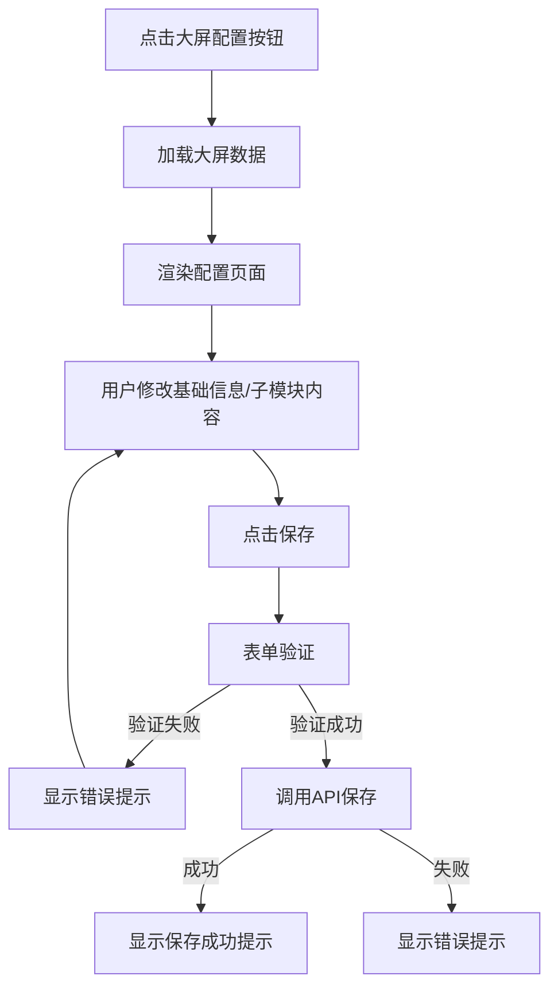
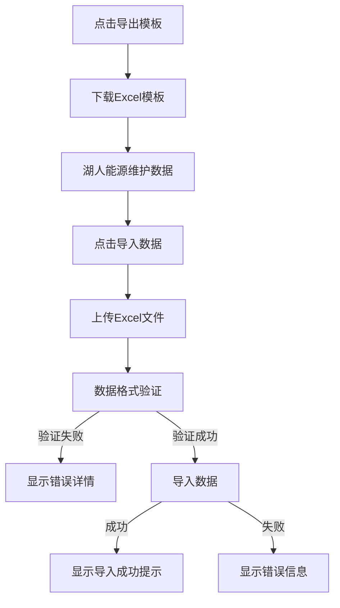
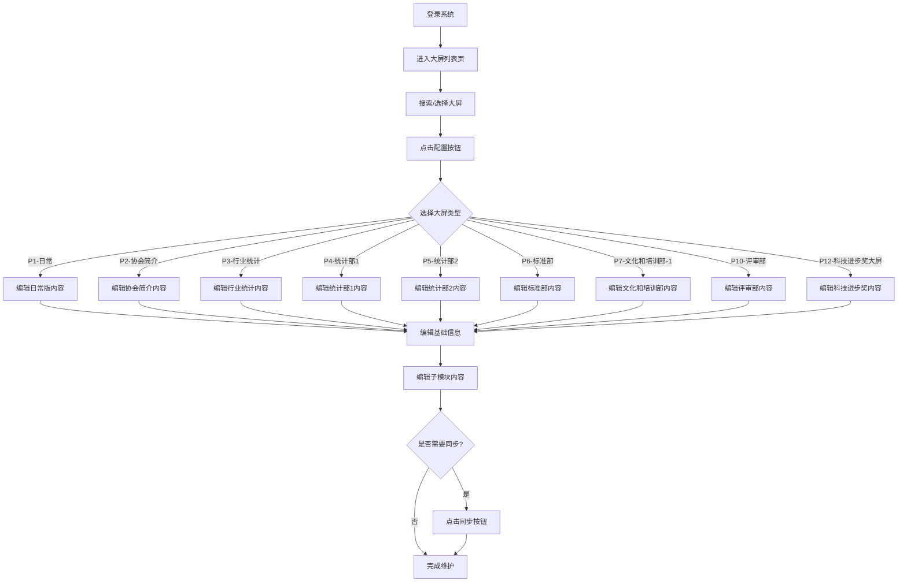
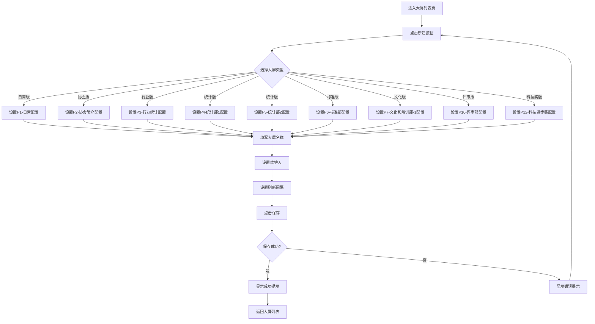

# 大屏管理系统需求设计文档

## 文档信息

| 项目名称 | 人民城轨2.0 - 大屏管理系统 |
|---------|------------------------|
| 文档版本 | v2.0 |
| 文档类型 | 功能需求设计文档 |
| 创建日期 | 2025-10-13 |
| 更新日期 | 2024-05-16 |
| 产品经理 | AI产品专家 |
| 适用范围 | B端后台管理系统 |
| 修改记录 | 基于Figma设计更新8种大屏界面，扩展模块类型，优化数据模型和业务流程 |

---

## 目录

1. [需求概述](#1-需求概述)
2. [产品定位](#2-产品定位)
3. [用户角色](#3-用户角色)
4. [功能架构](#4-功能架构)
5. [核心功能详细设计](#5-核心功能详细设计)
6. [数据模型设计](#6-数据模型设计)
7. [业务流程设计](#7-业务流程设计)
8. [交互设计规范](#8-交互设计规范)
9. [异常处理机制](#9-异常处理机制)
10. [性能要求](#10-性能要求)
11. [安全要求](#11-安全要求)
12. [扩展性设计](#12-扩展性设计)

---

## 1. 需求概述

### 1.1 项目背景

人民城轨协会需要一套数据大屏内容管理系统，用于维护各类大屏中展示的子模块内容信息。系统需要提供便捷的内容编辑和管理功能，确保大屏展示内容的及时更新。

**现存痛点：**
- ❌ 内容更新繁琐，需要技术人员介入
- ❌ 配置管理不清晰

### 1.2 产品目标

打造一套**简单高效的大屏内容管理系统**，实现：

✅ **便捷维护** - 运营人员可独立完成大屏子模块内容更新  
✅ **配置清晰** - 大屏配置管理结构明确，便于维护
✅ **内容同步** - 支持发布内容的同步功能

### 1.3 核心价值

| 价值维度 | 提升效果 | 量化指标 |
|---------|---------|---------|
| **效率提升** | 内容更新速度 | 从10分钟缩短到3分钟，提升**70%** |
| **成本降低** | 人力成本 | 减少技术人员介入，降低成本**50%** |
| **质量提升** | 准确率 | 结构化编辑减少错误，准确率提升**85%** |

---

## 2. 产品定位

### 2.1 产品类型

**B端内容管理系统**，面向企业内部运营人员的专业工具。

### 2.2 核心特色

🌟 **模块化管理** - 大屏子模块独立编辑，灵活维护  
🌟 **配置清晰** - 大屏配置结构明确，易于理解
🌟 **内容同步** - 支持发布内容的同步功能

### 2.3 技术架构

```
前端技术栈：
├── React 17 - 组件化框架
├── Ant Design 4.24 - UI组件库
└── Moment.js - 时间处理

后端技术栈（生产环境）：
├── RESTful API - 接口规范
└── MySQL - 数据持久化

安全合规：
└── 等保三级 - 安全合规要求
```

---

## 3. 用户角色

### 3.1 角色定义

| 角色名称 | 职责范围 | 权限级别 | 典型场景 |
|---------|---------|---------|---------|
| **超级管理员** | 系统全部功能 | 最高 | 系统配置、用户管理、全局设置 |
| **内容运营人员** | 内容编辑管理 | 高 | 日常新闻更新、数据维护 |
| **数据维护员** | 数据录入更新 | 中 | 统计数据、会员信息维护 |
| **只读查看者** | 仅查看权限 | 低 | 查看大屏内容 |

### 3.2 用户画像

**主要用户：内容运营人员**
- 年龄：25-40岁
- 学历：大专及以上
- 技能：熟悉Office办公软件，无编程经验
- 痛点：希望快速更新内容，不想依赖技术人员
- 诉求：操作简单、效果直观、不出错

---

## 4. 功能架构

### 4.1 功能架构图

```
大屏管理系统
│
├── 1. 大屏列表管理
│   ├── 1.1 大屏列表展示
│   ├── 1.2 搜索筛选功能
│   ├── 1.3 大屏新建/删除
│   └── 1.4 批量操作
│
├── 2. 大屏配置管理 ⭐核心
│   ├── 2.1 子模块内容编辑
│   ├── 2.2 刷新间隔配置
│   ├── 2.3 维护信息管理
│   └── 2.4 同步功能入口
│
└── 3. 多界面支持
    ├── 3.1 日常版界面（P1-日常）
    ├── 3.2 协会版界面（P2-协会简介）
    ├── 3.3 行业版界面（P3-行业统计）
    ├── 3.4 统计版界面（P4-统计部1、P5-统计部2）
    ├── 3.5 标准版界面（P6-标准部）
    ├── 3.6 文化版界面（P7-文化和培训部-1）
    ├── 3.7 评审版界面（P10-评审部）
    └── 3.8 科技奖界面（P12-科技进步奖大屏）
```

### 4.2 功能优先级

| 优先级 | 功能模块 | 开发周期 | 重要程度 |
|-------|---------|---------|---------|
| **P0** | 大屏列表管理 | 1周 | 基础功能，必须实现 |
| **P0** | 大屏配置管理 | 2周 | 核心功能，必须实现 |
| **P1** | 多界面支持 | 3周 | 重要功能，优先实现，包含8个大屏界面 |

---

## 5. 核心功能详细设计

### 5.1 大屏列表管理

#### 5.1.1 功能描述

提供大屏配置的集中管理界面，支持查看、创建、编辑、删除大屏配置。

#### 5.1.2 功能字段

**大屏列表字段：**
| 字段名称 | 字段类型 | 是否必填 | 说明 |
|---------|---------|---------|------|
| id | Long | 是 | 大屏唯一标识 |
| name | String(100) | 是 | 大屏名称 |
| maintenanceUser | String(50) | 是 | 维护人 |
| maintenanceTime | DateTime | 是 | 维护时间 |
| refreshInterval | Integer | 是 | 刷新间隔（秒），默认30 |
| createTime | DateTime | 是 | 创建时间 |
| createUser | String(50) | 是 | 创建人 |

#### 5.1.3 交互逻辑

**页面加载：**
```
1. 进入页面
   ↓
2. 调用API获取大屏列表
   ↓
3. 渲染大屏列表表格
   ↓
4. 显示加载完成状态
```

**搜索筛选：**
```
用户输入搜索关键词/选择筛选条件
   ↓
前端实时过滤数据
   ↓
更新表格显示
   ↓
无结果时显示空状态提示
```

#### 5.1.4 异常处理

| 异常场景 | 处理方式 | 用户提示 |
|---------|---------|---------|
| 网络请求失败 | 显示错误提示，提供重试按钮 | "网络连接失败，请检查网络后重试" |
| 数据加载超时 | 10秒超时，显示超时提示 | "加载超时，请刷新页面重试" |
| 权限不足 | 禁用操作按钮，显示权限提示 | "您没有权限执行此操作" |
| 并发冲突 | 提示数据已被修改，刷新数据 | "数据已被其他用户修改，已为您刷新最新数据" |

---

### 5.2 大屏配置管理 ⭐核心功能

#### 5.2.1 功能描述

提供大屏子模块内容的编辑和管理功能，支持配置刷新间隔、维护信息，并提供同步功能入口。同时支持Excel模板导出和导入功能，用于图标类数据的批量维护。

#### 5.2.2 功能结构

```
大屏配置管理
│
├── 顶部工具栏
│   ├── 返回按钮
│   ├── 大屏名称显示
│   ├── 保存修改按钮
│   ├── 同步按钮（功能待定）
│   └── Excel操作
│       ├── 导出模板按钮
│       └── 导入数据按钮
│
├── 基础信息配置
│   ├── 大屏名称
│   ├── 维护人
│   ├── 刷新间隔（秒）
│   └── 保存按钮
│
└── 子模块内容编辑
    ├── 模块列表展示
    ├── 模块内容编辑表单
    ├── 表单验证
    └── 保存按钮
```

#### 5.2.3 子模块类型及编辑字段

**1. 新闻类模块（行业新闻、党建园地）**

| 字段名称 | 字段类型 | 验证规则 | 默认值 |
|---------|---------|---------|--------|
| title | String(200) | 必填，最多200字符 | - |
| date | Date | 必填，格式：YYYY-MM-DD | 当前日期 |
| image | String(500) | 选填，URL格式 | 默认占位图 |
| content | Text | 选填，富文本 | - |
| sort | Integer | 必填，1-100 | 自动递增 |

**2. 列表类模块（工作规划）**

| 字段名称 | 字段类型 | 验证规则 | 示例 |
|---------|---------|---------|------|
| title | String(100) | 必填，最多100字符 | "城轨业主领导人峰会" |
| month | String(10) | 必填，格式：N月 | "6月" |
| location | String(50) | 选填 | "北京" |
| description | String(500) | 选填 | - |

**3. 配置类模块（限行尾号）**

| 字段名称 | 字段类型 | 验证规则 | 示例 |
|---------|---------|---------|------|
| todayNumbers | String(10) | 必填，格式：N, N | "3, 8" |
| tomorrowNumbers | String(10) | 必填，格式：N, N | "4, 9" |
| timeRange | String(20) | 必填，格式：HH:MM-HH:MM | "07:00-20:00" |
| weekSchedule | Array(7) | 必填，7个元素 | ["1/6", "2/7", ...] |

**4. 数据类模块（会员统计、行业统计）**

| 字段名称 | 字段类型 | 验证规则 | 说明 |
|---------|---------|---------|------|
| total | Integer | 必填，≥0 | 总数统计 |
| categories | Array | 必填，至少1项 | 分类数据 |
| categories[].name | String(50) | 必填 | 分类名称 |
| categories[].value | Integer | 必填，≥0 | 分类数值 |

**5. 统计图表类模块（基于Figma设计）**

| 字段名称 | 字段类型 | 验证规则 | 说明 |
|---------|---------|---------|------|
| chartTitle | String(200) | 必填 | 图表标题 |
| dataSource | JSON | 必填 | 图表数据源 |
| chartType | String(50) | 必填 | 图表类型（柱状图/饼图/折线图） |
| yearRange | String(50) | 选填 | 年份范围（如：2018~2024） |

**6. 城市信息类模块（基于Figma P1-日常）**

| 字段名称 | 字段类型 | 验证规则 | 说明 |
|---------|---------|---------|------|
| cityName | String(50) | 必填 | 城市名称 |
| date | String(50) | 必填 | 日期（如：05月16日 | 周三） |
| weather | String(100) | 必填 | 天气信息（如：多云转晴 22~32℃） |

**7. 科技奖类模块（基于Figma P12-科技进步奖大屏）**

| 字段名称 | 字段类型 | 验证规则 | 说明 |
|---------|---------|---------|------|
| awardName | String(200) | 必填 | 奖项名称 |
| yearRange | String(50) | 必填 | 年份范围 |
| introduction | Text | 必填 | 奖项简介 |
| statisticsData | JSON | 必填 | 统计数据（申报数量、获奖数量等） |
| yearlyData | Array | 必填 | 年度申报/获奖数据 |
| yearlyData[].year | String(10) | 必填 | 年份 |
| yearlyData[].applications | Integer | 必填 | 申报数量 |
| yearlyData[].awards | Integer | 必填 | 获奖数量 |
| yearlyData[].organizations | Integer | 必填 | 申报单位数量 |

#### 5.2.4 交互流程

**配置编辑流程：**



**同步功能流程：**
```
用户点击"同步"按钮
   ↓
显示同步中状态
   ↓
调用同步API（功能待定）
   ↓
显示同步结果提示
```

**Excel数据维护流程：**


#### 5.2.5 异常处理

| 异常场景 | 处理方式 | 用户提示 |
|---------|---------|---------|
| 数据加载失败 | 显示错误页，提供重试按钮 | "数据加载失败，点击重试" |
| 模块数据格式错误 | 使用默认值，记录错误日志 | "部分数据加载异常，已使用默认值" |
| 保存失败 | 显示错误信息 | "保存失败，请重试" |
| 网络断开 | 禁用保存，提示离线状态 | "网络已断开，请检查网络连接" |
| Excel模板下载失败 | 显示错误提示 | "模板下载失败，请稍后重试" |
| Excel文件格式错误 | 显示错误提示，提供格式说明 | "文件格式错误，请使用正确的Excel模板" |
| 数据验证失败 | 显示详细错误信息，包括具体行和列 | "数据验证失败，第X行第Y列：错误说明" |
| 导入数据量过大 | 分批导入，显示进度条 | "数据量较大，正在分批导入，请耐心等待" |

### 5.3 多界面支持

**功能描述**：系统支持多种大屏界面布局，根据Figma设计文件，包含8种不同的大屏界面设计。每种界面针对不同的业务场景，展示特定领域的关键数据和信息，满足不同用户群体的需求。

**功能结构**：

| 界面类型 | 界面ID | 适用场景 | 主要内容 |
|---------|-------|--------|--------|
| 日常版界面 | P1-日常 | 日常运营监控 | 城市信息、天气、日期显示、核心运营指标 |
| 协会版界面 | P2-协会简介 | 协会介绍展示 | 协会简介、组织架构、发展历程、会员单位概况 |
| 行业版界面 | P3-行业统计 | 行业数据概览 | 运营线路城市群分布、全国轨道交通统计、行业关键指标 |
| 统计版界面 | P4-统计部1 | 深度统计分析 | 近十年运营里程数据、时间轴数据、客运强度排名表格 |
| 统计版界面 | P5-统计部2 | 性能指标分析 | 高峰小时最小发车间隔、运营服务时长、全自动运行线路数据、能耗与排放数据 |
| 标准版界面 | P6-标准部 | 标准管理展示 | 标准化工作组织架构、制度管理、标准发布情况 |
| 文化版界面 | P7-文化和培训部-1 | 行业文化展示 | 文化博览会信息、行业庆典活动、文化建设成果 |
| 评审版界面 | P10-评审部 | 职称评审管理 | 历年职称评审数据、专业占比、地域分布、评审通过率 |
| 科技奖界面 | P12-科技进步奖大屏 | 科技成果展示 | 科技进步奖简介、历年申报情况、获奖数据分析、申报单位分布 |

**大屏界面详细说明**：

1. **P1-日常**：日常运营监控界面，展示城市信息、当前日期和天气状况，为用户提供基础信息参考。

2. **P2-协会简介**：包含协会简介文本、组织架构图、发展历程时间线和会员单位概况，全面展示协会的基本情况。

3. **P3-行业统计**：展示"2024年行业信息统计"，包含运营线路城市群分布（京津冀24%、珠三角27%等）、全国轨道交通统计数据（59个城市、12160.77公里总里程、361条线路等）。

4. **P4-统计部1**：展示近十年运营里程数据、2015-2024年时间轴数据、客运强度排名表格（广州1号线4.51、广州2号线3.49等前五线路数据）。

5. **P5-统计部2**：展示高峰小时最小发车间隔、线网平均运营服务时长、全自动运行线路数据（23个城市、54条线路、1484.43公里）、2023-2024年电能耗与CO2排放对应表。

6. **P6-标准部**：展示标准化工作组织架构、11项制度名称及对应排名和发布时间（如"团体标准管理办法"2017.3首次发布、2020.5修订）。

7. **P7-文化和培训部-1**：展示文化相关活动信息，包括"首届中国城市轨道交通文化博览会"、"中国地铁运营50周年系列活动 · 2019年"等文化活动描述。

8. **P10-评审部**：展示职称评审相关数据，包括历年职称评审申报各专业占比人数、地域分布，以及评审介绍文本（2019年获授权开展评审工作，2024年获正高级职称评审资格，累计2897人申报，1752人通过）。

9. **P12-科技进步奖大屏**：展示科技进步奖相关数据，包括2018~2024年度申报项目数量、申报项目单位主要分布、科技进步奖简介（2018年设立，七年评奖，828项申报，209项获奖）和2018-2024年申报数量与单位数据。

---

## 6. 数据模型设计

### 6.1 大屏信息表（screen_info）

| 字段名 | 数据类型 | 约束 | 描述 |
|-------|---------|------|------|
| id | VARCHAR(36) | PRIMARY KEY | 大屏ID |
| name | VARCHAR(255) | NOT NULL | 大屏名称 |
| screen_type | VARCHAR(50) | NOT NULL | 大屏类型（日常版、协会版等） |
| screen_id | VARCHAR(50) | | 界面ID（如P1-日常、P2-协会简介等） |
| refresh_interval | INT | NOT NULL DEFAULT 30 | 刷新间隔（秒） |
| maintenance_user | VARCHAR(50) | NOT NULL | 维护人 |
| maintenance_time | DATETIME | NOT NULL | 维护时间 |
| create_time | DATETIME | NOT NULL | 创建时间 |
| create_user | VARCHAR(50) | NOT NULL | 创建人 |
| status | INTEGER | DEFAULT 1 | 状态（1-启用，0-禁用） |

### 6.2 模块数据表（module_data）

| 字段名 | 数据类型 | 约束 | 描述 |
|-------|---------|------|------|
| id | BIGINT | PRIMARY KEY AUTO_INCREMENT | 记录ID |
| screen_id | VARCHAR(36) | NOT NULL, FOREIGN KEY | 所属大屏ID |
| module_type | VARCHAR(50) | NOT NULL | 模块类型（新闻类、列表类、统计图表类、城市信息类、科技奖类等） |
| module_key | VARCHAR(50) | NOT NULL | 模块标识 |
| data | JSON | NOT NULL | 模块数据 |
| update_time | DATETIME | NOT NULL | 更新时间 |
| update_user | VARCHAR(50) | NOT NULL | 更新人 |
| import_batch_id | VARCHAR(100) | NULL | Excel导入批次ID |
| import_time | DATETIME | NULL | Excel导入时间 |

### 6.3 大屏特定数据模型扩展

基于Figma设计的8种大屏界面，针对不同界面类型增加以下扩展字段：

1. **协会简介类大屏**
   - organization_structure: JSON - 组织架构数据
   - development_history: Array - 发展历程数据
   - member_units: JSON - 会员单位概况

2. **统计图表类大屏**
   - chart_data: JSON - 图表数据
   - year_range: String - 年份范围
   - statistics_summary: JSON - 统计摘要信息

3. **科技奖类大屏**
   - award_introduction: Text - 奖项简介
   - yearly_data: Array - 年度数据
   - organization_distribution: JSON - 申报单位分布数据

---

## 7. 业务流程设计

### 7.1 大屏内容维护流程



### 7.2 大屏创建流程



---

## 8. 交互设计规范

### 8.1 界面布局
- 顶部导航栏：系统名称、用户信息、退出按钮
- 左侧菜单栏：功能模块导航
- 主内容区：功能操作区域
- 右侧面板：（可选）辅助信息展示

### 8.2 操作反馈
- 成功提示：绿色提示信息，自动消失
- 错误提示：红色提示信息，需用户确认
- 加载状态：显示加载动画，禁用相关操作

### 8.3 表单设计
- 表单项布局：左标签右输入
- 验证反馈：实时验证，错误提示在对应字段下方
- 必填项标识：红色星号

### 8.4 大屏类型特定交互
- **日常版界面(P1)**: 提供城市信息快速编辑功能
- **协会版界面(P2)**: 支持组织架构图可视化配置
- **行业版界面(P3)**: 提供行业数据统计图表配置
- **统计版界面(P4/P5)**: 支持多维度数据对比和时间范围选择
- **标准版界面(P6)**: 提供标准发布状态管理
- **文化版界面(P7)**: 支持活动信息和文化内容管理
- **评审版界面(P10)**: 提供评审数据和结果可视化编辑
- **科技奖界面(P12)**: 支持年度数据和获奖信息管理

---

## 9. 异常处理机制

### 9.1 异常类型

| 异常类型 | 处理方式 |
|---------|---------|
| 输入验证异常 | 显示详细错误信息，引导用户修正 |
| 网络异常 | 显示网络错误提示，提供重试按钮 |
| 服务器异常 | 显示通用错误提示，记录详细日志 |
| 权限异常 | 跳转到无权限提示页或禁用相关操作 |
| 图表数据格式错误 | 提示数据格式问题，提供示例 |
| 大屏类型选择错误 | 提示选择正确的大屏类型 |
| 文件上传失败 | 提示上传失败原因，限制文件大小和格式 |

### 9.2 日志记录
- 操作日志：记录用户的关键操作
- 错误日志：记录系统错误信息
- 审计日志：记录敏感操作信息

---

## 9.3 容错机制
- **自动保存**：在配置过程中，系统每30秒自动保存一次配置，避免用户数据丢失
- **数据验证**：对用户输入的数据进行严格验证，确保数据的合法性和完整性
- **错误日志**：记录所有操作日志和错误信息，便于问题排查和系统优化
- **恢复机制**：在系统出现异常时，提供数据恢复功能，确保数据安全

---

## 10. 性能要求

1. **响应时间**：大屏列表页面加载时间不超过2秒，配置页面加载时间不超过3秒。
2. **并发支持**：系统应支持至少10个用户同时进行大屏配置操作。
3. **数据刷新**：支持实时数据刷新，刷新间隔可配置（最小5秒，最大3600秒）。
4. **大屏展示**：大屏展示页面应保证流畅运行，无卡顿现象。
5. **资源占用**：系统运行时CPU占用率不超过30%，内存占用率不超过50%。

## 11. 安全要求

1. **身份认证**：系统应实现基于角色的访问控制（RBAC），不同角色具有不同的操作权限。
2. **数据加密**：敏感数据在传输和存储过程中应进行加密处理。
3. **操作审计**：记录所有用户操作日志，包括登录、查询、修改、删除等操作。
4. **防SQL注入**：对用户输入进行严格过滤，防止SQL注入攻击。
5. **防XSS攻击**：对用户输入的内容进行转义处理，防止跨站脚本攻击。
6. **会话管理**：实现安全的会话管理机制，包括会话超时、会话失效等。

## 12. 可扩展性要求

1. **模块化设计**：系统应采用模块化设计，便于功能扩展和维护。
2. **接口标准化**：提供标准化的API接口，便于与其他系统集成。
3. **插件支持**：支持通过插件方式扩展系统功能，如新增图表类型、新增数据源等。
4. **配置化设计**：核心功能参数应支持配置化，无需修改代码即可调整系统行为。

---

## 10. 性能要求

### 10.1 响应时间
- 页面加载：≤3秒
- 数据保存：≤1秒
- 搜索筛选：≤1秒

### 10.2 并发支持
- 支持100人同时在线操作
- 支持20人同时编辑不同大屏内容

---

## 11. 安全要求

### 11.1 数据安全
- 敏感数据加密存储
- 数据传输使用HTTPS加密
- 定期数据备份

### 11.2 访问控制
- 基于角色的权限管理
- 登录超时自动退出
- 关键操作需要二次确认

### 11.3 等保三级要求
- 满足国家网络安全等级保护三级要求
- 定期安全审计和漏洞扫描
- 完善的安全管理制度

---

## 12. 扩展性设计

### 12.1 功能扩展
- 模块化设计，便于新增功能
- 预留接口，支持第三方系统集成

### 12.2 数据扩展
- 支持新增模块类型
- 灵活的数据结构设计，适应未来需求变化

### 12.3 性能扩展
- 数据库索引优化
- 支持水平扩展部署


