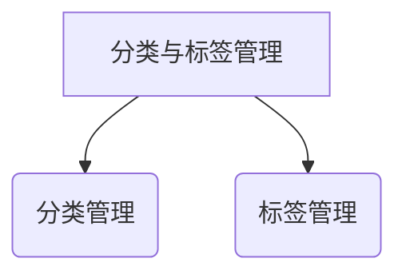
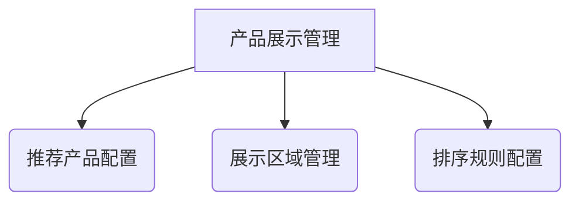
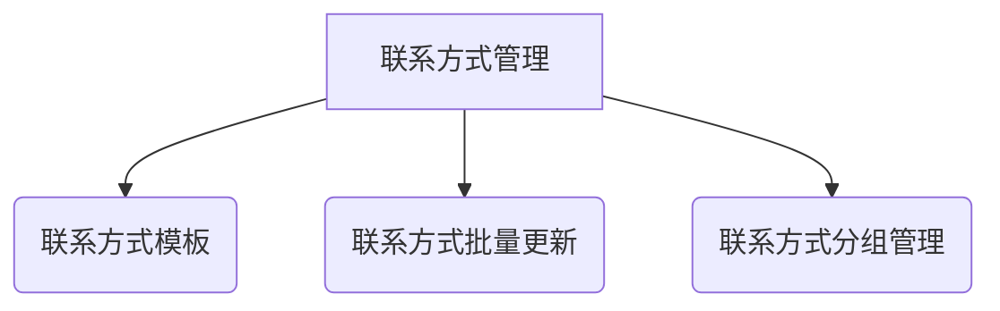
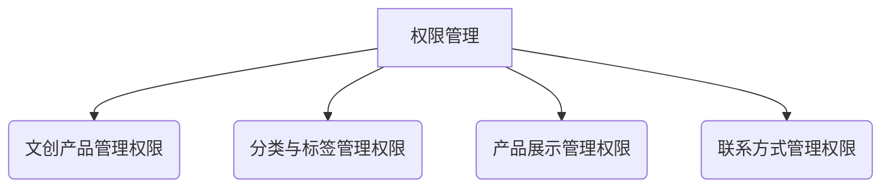
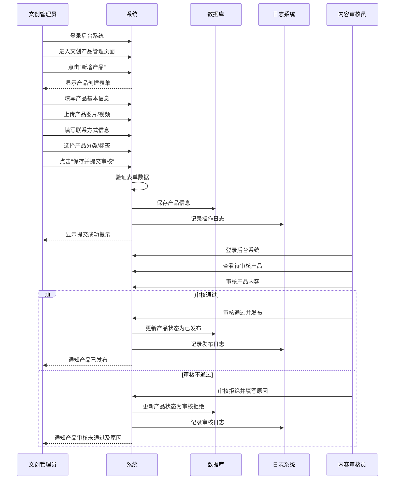
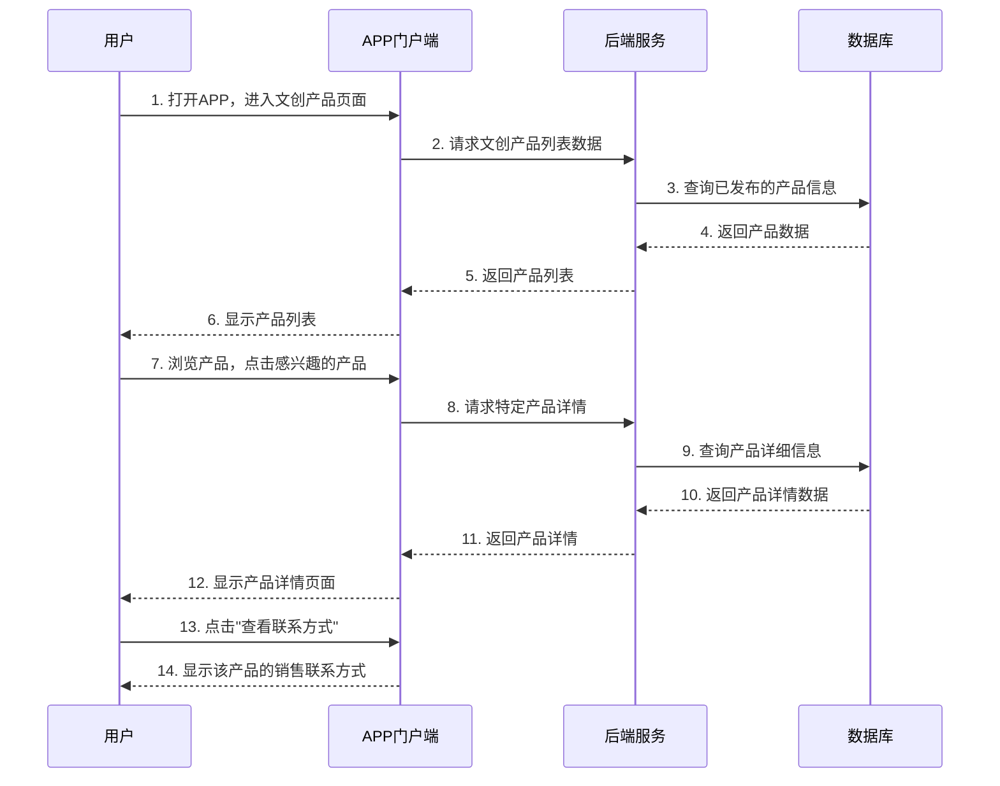
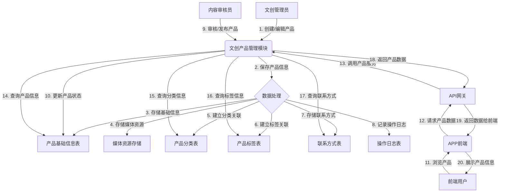
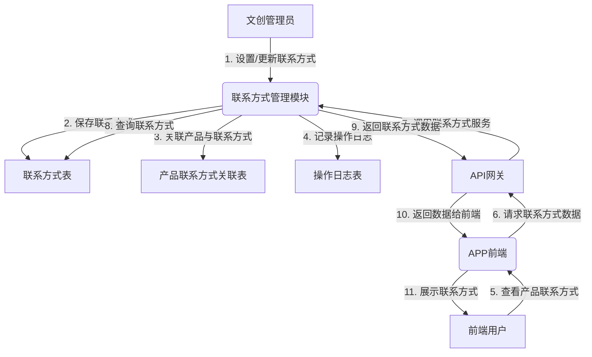

# 人民城轨-运营平台-文创管理模块-功能需求文档 (FRD)

**版本**: v1.0
**日期**: 2024-07-29  
**负责人**: [产品经理姓名]

> 本文档旨在详细定义"人民城轨-运营平台"文创管理模块的功能需求。本文档将作为研发、测试和设计团队的工作依据，确保各方对产品功能有统一、清晰的理解。

---

## 一、 产品概述

### 1.1 产品定位

人民城轨文创管理模块是人民城轨平台的内容展示功能模块之一，专注于提供文创产品的展示服务。该模块作为浏览平台，负责文创产品的信息发布、分类管理和多媒体展示，同时为用户提供产品销售联系方式，平台不直接参与售卖过程。

### 1.2 产品目标

1. **提升品牌形象**：通过精美的文创产品展示，增强用户对轨道交通文化的认知和了解。
2. **便捷信息获取**：为用户提供直观、高效的文创产品信息浏览和查询功能。
3. **促进业务合作**：通过清晰展示产品联系方式，方便用户与销售渠道建立联系。
4. **规范运营管理**：为运营人员提供产品内容管理工具，确保信息的准确性和及时性。

### 1.3 核心功能模块

1. **文创产品管理**：负责文创产品的创建、编辑、发布、下架等操作。
2. **分类与标签管理**：负责产品分类结构维护和标签管理。
3. **产品展示管理**：负责产品在前端的展示方式和顺序控制。
4. **联系方式管理**：负责维护和更新产品的销售联系方式。

### 1.4 术语定义

| 术语 | 解释说明 |
|-----|---------|
| 文创产品 | 基于轨道交通文化元素设计开发的各类商品，包括杂志、纪念品、模型、衍生品等 |
| 分类 | 用于对文创产品进行分组管理的层级结构 |
| 标签 | 用于对文创产品进行标记和快速查找的关键词 |
| 展示状态 | 产品在前端是否可见，包括上架和下架两种状态 |
| 联系方式 | 用于产品销售咨询和购买的联系信息，如电话、邮箱或联系人等 |
| 等保三级 | 网络安全等级保护三级，是中国网络安全等级保护制度中的第三级安全等级 |

### 1.5 系统角色与职责

| 角色名称 | 职责描述 |
|---------|--------|
| 系统管理员 | 负责系统的整体配置、用户管理、权限设置等 |
| 文创管理员 | 负责文创产品的创建、编辑、发布、下架等操作 |
| 运营管理员 | 负责分类管理、标签管理、产品展示配置等操作 |
| 内容审核员 | 负责产品内容的审核，确保合规性 |

### 1.6 产品架构

```mermaid
graph TD
    A[文创管理模块] --> B(文创产品管理);
    A --> C(分类与标签管理);
    A --> D(产品展示管理);
    A --> E(联系方式管理);
``` |

## 二、 功能需求

### 2.1 文创产品管理

#### 2.1.1 功能描述

文创产品管理是整个模块的核心功能，负责文创产品的创建、编辑、删除、发布、下架等全生命周期管理，支持产品信息的富文本编辑和多媒体展示。

#### 2.1.2 功能结构

```mermaid
graph TD
    A[文创产品管理] --> B(产品列表管理);
    A --> C(产品创建/编辑);
    A --> D(产品发布/下架);
    A --> E(产品回收站);
```

#### 2.1.3 功能字段与交互

##### 2.1.3.1 产品列表管理

- **UI展示**: 表格形式展示所有文创产品
- **字段**:
  - `产品ID`: 唯一标识
  - `产品名称`: 产品的完整名称
  - `所属分类`: 产品所属的分类
  - `产品标签`: 关联的产品标签
  - `展示状态`: 上架/下架
  - `创建时间`: 产品创建日期
  - `更新时间`: 最近一次修改日期
  - `操作`: 查看详情、编辑、发布/下架、删除等按钮
- **交互逻辑**:
  - 支持按产品ID、名称、分类、状态等多维度筛选和搜索
  - 支持批量发布和批量删除操作
  - 列表支持分页显示，每页默认20条

##### 2.1.3.2 产品创建/编辑

- **UI展示**: 表单形式，分步填写产品信息
- **字段**:
  - `产品基本信息`:
    - 产品名称 (必填)
    - 产品描述 (富文本编辑器)
    - 产品封面图 (支持上传多张，第一张作为封面)
    - 产品详情图 (支持多图上传，可拖拽排序)
    - 产品视频 (支持上传，用于更直观展示产品)
  - `产品规格信息`:
    - 产品编码
    - 产品重量
    - 产品尺寸
    - 包装信息
  - `分类与标签`:
    - 产品分类 (多选)
    - 产品标签 (多选)
  - `联系方式`:
    - 联系人
    - 联系电话
    - 联系邮箱
    - 其他联系方式
  - `其他配置`:
    - 是否上架 (开关)
    - 是否推荐 (开关)
    - 推荐排序
    - 上架时间
    - 下架时间
    - 产品SEO信息 (标题、关键词、描述)

- **交互逻辑**:
  - 表单验证，必填项未填写时提示用户
  - 支持产品草稿保存功能
  - 支持产品预览，查看在前端展示的效果
  - 图片上传支持拖拽、裁剪和压缩

##### 2.1.3.3 产品发布/下架

- **UI展示**: 单个产品操作按钮或批量操作按钮
- **交互逻辑**:
  - 单个产品可通过编辑页面或列表页快捷操作进行发布/下架
  - 支持批量选择产品进行发布/下架操作
  - 发布/下架操作记录日志，满足等保三级要求

##### 2.1.3.4 产品回收站

- **UI展示**: 列表形式展示已删除产品
- **字段**:
  - 与产品列表相同
  - 额外显示删除时间和删除人
- **交互逻辑**:
  - 支持恢复已删除产品
  - 支持永久删除产品
  - 产品默认在回收站保留30天，超过时间自动永久删除

### 2.2 分类与标签管理

#### 2.2.1 功能描述

分类与标签管理功能负责维护文创产品的分类结构和标签体系，支持多级分类管理和标签的增删改查操作，便于产品的组织和用户查找。

#### 2.2.2 功能结构



#### 2.2.3 功能字段与交互

##### 2.2.3.1 分类管理

- **UI展示**: 树形结构展示产品分类
- **字段**:
  - `分类ID`: 唯一标识
  - `分类名称`: 分类名称
  - `父分类`: 所属上级分类
  - `分类图标`: 分类显示图标
  - `排序`: 显示顺序
  - `状态`: 启用/禁用
  - `操作`: 编辑、删除、查看子分类

- **交互逻辑**:
  - 支持多级分类管理（最多三级）
  - 支持拖拽调整分类顺序
  - 支持分类图标上传
  - 删除分类时需检查是否有关联产品，有关联时提示用户

##### 2.2.3.2 标签管理

- **UI展示**: 列表形式展示所有标签
- **字段**:
  - `标签ID`: 唯一标识
  - `标签名称`: 标签名称
  - `使用次数`: 该标签被使用的次数
  - `创建时间`: 标签创建日期
  - `操作`: 编辑、删除

- **交互逻辑**:
  - 支持标签搜索
  - 支持批量删除标签
  - 删除标签时，自动解除与产品的关联

### 2.3 产品展示管理

#### 2.3.1 功能描述

产品展示管理功能负责配置文创产品在前端的展示方式和展示顺序，支持推荐产品设置、展示区域配置等操作，提升用户浏览体验。

#### 2.3.2 功能结构



#### 2.3.3 功能字段与交互

##### 2.3.3.1 推荐产品配置

- **UI展示**: 拖拽式产品选择界面
- **字段**:
  - `推荐区域名称`: 推荐位的名称（如首页轮播、精选推荐等）
  - `推荐产品列表`: 推荐的产品集合，可拖拽排序
  - `推荐数量限制`: 每个推荐区域最多推荐的产品数量
  - `生效状态`: 启用/禁用

- **交互逻辑**:
  - 支持从已上架产品中选择推荐产品
  - 支持拖拽调整推荐产品的显示顺序
  - 支持设置推荐产品的生效时间范围

##### 2.3.3.2 展示区域管理

- **UI展示**: 配置页面，支持可视化编辑
- **字段**:
  - `区域ID`: 唯一标识
  - `区域名称`: 展示区域名称
  - `区域位置`: 页面位置描述
  - `展示样式`: 列表/网格/轮播等
  - `显示数量`: 该区域显示的产品数量
  - `是否启用`: 开关

- **交互逻辑**:
  - 支持自定义展示区域的布局和样式
  - 支持设置每个区域的产品筛选条件
  - 支持预览展示效果

##### 2.3.3.3 排序规则配置

- **UI展示**: 下拉选择和拖拽排序界面
- **字段**:
  - `默认排序规则`: 最新发布、最热、名称等
  - `自定义排序字段`: 可配置多字段组合排序
  - `排序方向`: 升序/降序

- **交互逻辑**:
  - 支持针对不同分类设置不同的默认排序规则
  - 支持用户在前端进行临时排序

### 2.4 联系方式管理

#### 2.4.1 功能描述

联系方式管理功能负责维护文创产品的销售联系方式信息，支持批量更新和分组管理，确保用户能够便捷地获取产品的购买渠道。

#### 2.4.2 功能结构



#### 2.4.3 功能字段与交互

##### 2.4.3.1 联系方式模板

- **UI展示**: 模板列表和编辑表单
- **字段**:
  - `模板名称`: 联系方式模板的名称
  - `联系人`: 联系人姓名
  - `联系电话`: 电话号码
  - `联系邮箱`: 电子邮箱
  - `联系地址`: 实体地址
  - `其他联系方式`: 微信、网站等

- **交互逻辑**:
  - 支持创建多个联系方式模板
  - 支持将模板应用到多个产品
  - 模板更新时可选择是否同步更新已应用的产品

##### 2.4.3.2 联系方式批量更新

- **UI展示**: 批量操作界面
- **字段**:
  - 产品选择（可按分类、标签等筛选）
  - 联系方式信息（可选择模板或手动输入）

- **交互逻辑**:
  - 支持按条件批量选择产品
  - 支持批量应用联系方式模板或更新联系方式
  - 批量操作前显示预览，确认无误后执行

##### 2.4.3.3 联系方式分组管理

- **UI展示**: 分组列表和详情配置
- **字段**:
  - `分组名称`: 联系方式分组名称
  - `关联产品`: 该分组下的产品列表
  - `联系方式`: 该分组的统一联系方式

- **交互逻辑**:
  - 支持创建多个联系方式分组
  - 支持将产品分配到不同分组
  - 支持查看分组下的产品列表

### 2.5 文创管理模块权限管理

#### 2.5.1 功能描述

文创管理模块权限管理功能负责控制不同角色对文创模块各功能的访问和操作权限，确保系统安全性和数据准确性。

#### 2.5.2 功能结构



#### 2.5.3 权限列表

| 权限名称 | 权限描述 | 适用角色 |
| :--- | :--- | :--- |
| `cultural_product:view` | 查看文创产品 | 文创管理员、运营管理员、内容审核员 |
| `cultural_product:create` | 创建文创产品 | 文创管理员 |
| `cultural_product:edit` | 编辑文创产品 | 文创管理员 |
| `cultural_product:delete` | 删除文创产品 | 文创管理员 |
| `cultural_product:publish` | 发布/下架文创产品 | 文创管理员、内容审核员 |
| `category:view` | 查看分类与标签 | 文创管理员、运营管理员 |
| `category:manage` | 管理分类与标签 | 运营管理员 |
| `display:view` | 查看展示配置 | 文创管理员、运营管理员 |
| `display:config` | 配置展示设置 | 运营管理员 |
| `contact:view` | 查看联系方式 | 文创管理员、运营管理员 |
| `contact:manage` | 管理联系方式 | 文创管理员、运营管理员 |

## 三、 业务流程

### 3.1 文创产品发布流程



### 3.2 用户浏览产品流程



## 四、 数据流向图

### 4.1 文创产品数据流向



### 4.2 联系方式数据流向



## 五、 异常处理机制

### 5.1 产品管理异常处理

| 异常场景 | 处理策略 | 错误提示 |
| :--- | :--- | :--- |
| 产品名称重复 | 系统检测并提示 | "产品名称已存在，请修改后重试" |
| 图片上传失败 | 提供重试机制 | "图片上传失败，请检查网络或图片大小" |
| 表单验证失败 | 实时验证并提示 | "[具体字段]格式不正确，请重新输入" |
| 产品删除失败 | 检查关联数据并提示 | "该产品有关联的分类或展示配置，无法删除" |
| 批量操作部分失败 | 执行成功的部分生效，失败部分提示 | "批量操作完成，其中X项失败：[失败原因列表]" |

### 5.2 分类与标签管理异常处理

| 异常场景 | 处理策略 | 错误提示 |
| :--- | :--- | :--- |
| 分类名称重复 | 系统检测并提示 | "分类名称已存在，请修改后重试" |
| 标签名称重复 | 系统检测并提示 | "标签名称已存在，请修改后重试" |
| 删除有子分类的分类 | 阻止删除并提示 | "该分类下还有子分类，请先删除子分类" |
| 删除有关联产品的分类 | 阻止删除并提示 | "该分类下还有产品，请先移除产品或删除产品" |

### 5.3 展示管理异常处理

| 异常场景 | 处理策略 | 错误提示 |
| :--- | :--- | :--- |
| 推荐产品数量超限 | 阻止添加并提示 | "已达到推荐产品数量上限" |
| 展示区域配置错误 | 系统验证并提示 | "配置参数有误，请检查后重试" |
| 排序规则设置冲突 | 系统检测并提示 | "排序规则设置存在冲突，请调整" |

### 5.4 联系方式管理异常处理

| 异常场景 | 处理策略 | 错误提示 |
| :--- | :--- | :--- |
| 联系方式信息不完整 | 表单验证并提示 | "联系方式信息不完整，请补充必填项" |
| 联系方式格式错误 | 实时验证并提示 | "联系电话/邮箱格式不正确" |
| 批量更新失败 | 部分更新并提示失败原因 | "批量更新完成，其中X项失败：[失败原因列表]" |

### 5.5 系统级异常处理

| 异常类型 | 处理策略 | 应对措施 |
| :--- | :--- | :--- |
| 数据库连接异常 | 自动重试连接，记录错误日志 | 监控告警，技术人员排查 |
| 服务器负载过高 | 请求队列处理，限流措施 | 动态扩容，优化性能 |
| 安全攻击检测 | 记录攻击日志，触发安全防护 | 封禁IP，安全加固 |
| 并发访问冲突 | 分布式锁，乐观锁机制 | 重试机制，事务隔离 |
| 系统崩溃恢复 | 自动重启，数据恢复机制 | 定期备份，灾难恢复计划 |

## 六、 性能与安全要求

### 6.1 性能要求

1. **响应时间**：页面加载时间<2秒，API响应时间<500ms
2. **并发处理**：支持5万用户同时在线浏览
3. **数据处理**：支持百万级产品数据的高效查询
4. **缓存策略**：对热点产品数据、分类数据采用多级缓存
5. **数据库优化**：合理索引设计，读写分离，分库分表（未来扩展）

### 6.2 安全要求（等保三级合规）

1. **身份认证**：多因素认证，密码复杂度要求，定期更换密码
2. **访问控制**：基于RBAC的细粒度权限控制，最小权限原则
3. **数据加密**：敏感数据加密存储，传输加密（HTTPS）
4. **审计日志**：所有关键操作记录详细日志，包括操作人、时间、内容、IP等
5. **防攻击措施**：防SQL注入、XSS攻击、CSRF攻击、暴力破解等
6. **数据备份与恢复**：定期全量和增量备份，支持快速恢复
7. **安全漏洞管理**：定期安全扫描，漏洞修复，补丁管理
8. **应急响应**：建立安全事件应急响应机制，定期演练

## 七、 实施与验收标准

### 7.1 实施计划

1. **需求确认**：与业务方确认功能需求，形成需求规格说明书
2. **设计阶段**：进行系统设计、数据库设计、接口设计
3. **开发阶段**：前后端开发，单元测试，集成测试
4. **测试阶段**：功能测试，性能测试，安全测试，用户验收测试
5. **上线准备**：数据迁移，系统部署，监控配置
6. **上线运行**：正式上线，密切监控系统运行状态
7. **运维优化**：根据运行情况持续优化和改进

### 7.2 验收标准

1. **功能完整性**：所有功能按照需求文档实现，无功能缺失
2. **性能达标**：满足规定的性能指标，如响应时间、并发处理能力等
3. **安全性**：通过安全测试，符合等保三级要求
4. **稳定性**：系统运行稳定，无重大bug，错误率低于0.1%
5. **可用性**：系统可用性达到99.9%
6. **兼容性**：支持主流浏览器和操作系统
7. **文档齐全**：提供完整的技术文档、操作手册和培训材料

## 八、 风险与应对

| 风险点 | 影响程度 | 应对措施 |
| :--- | :--- | :--- |
| 需求变更 | 高 | 建立变更管理流程，评估影响范围，及时调整计划 |
| 性能瓶颈 | 高 | 前期进行性能设计，预留扩展空间，定期性能测试和优化 |
| 数据安全 | 高 | 严格遵循等保三级要求，定期安全审计，加强访问控制 |
| 系统稳定性 | 高 | 完善的监控告警机制，定期备份，制定应急预案 |
| 内容审核效率 | 中 | 建立高效的内容审核流程，可考虑引入自动化审核工具 |
| 用户接受度 | 中 | 提前收集用户反馈，进行用户培训，持续优化用户体验 |
| 技术债务 | 中 | 定期重构代码，保持代码质量，完善测试覆盖 |

---

**文档审批**

| 角色 | 姓名 | 日期 | 签名 |
| :--- | :--- | :--- | :--- |
| 产品经理 | | | |
| 技术负责人 | | | |
| 业务负责人 | | | |
| 安全负责人 | | | |

---

**版本历史**

| 版本 | 日期 | 更新内容 | 更新人 |
| :--- | :--- | :--- | :--- |
| v1.0 | 2024-07-29 | 初始版本 | |