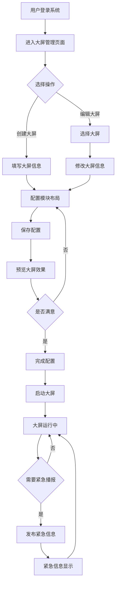
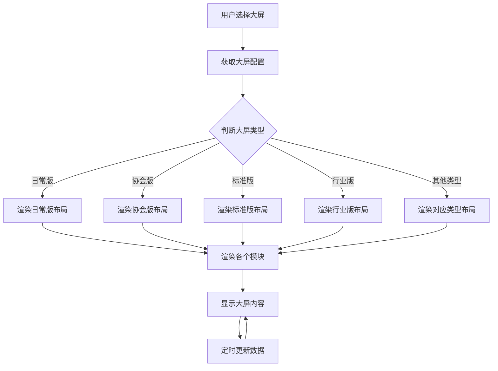

# 大屏管理模块功能设计文档

## 1. 功能概述

大屏管理模块是人民城轨管理系统的核心功能模块之一，用于创建、编辑、预览和控制各类数据大屏，为管理决策提供可视化支持。该模块支持多种大屏类型，提供丰富的功能模块，并允许用户进行自定义配置。

## 2. 功能列表

### 2.1 大屏基础管理功能

| 功能ID | 功能名称 | 功能描述 | 优先级 |
|--------|----------|----------|--------|
| F001   | 大屏列表展示 | 展示所有已创建的大屏，支持筛选和搜索 | 高 |
| F002   | 大屏创建编辑 | 创建新大屏或编辑现有大屏的配置信息 | 高 |
| F003   | 大屏预览 | 实时预览大屏效果，支持缩放和平移 | 高 |
| F004   | 大屏状态控制 | 启动/停止大屏数据更新 | 高 |
| F005   | 紧急信息播报 | 发布和管理紧急信息，在大屏上高亮显示 | 高 |

### 2.2 大屏类型管理

| 功能ID | 功能名称 | 功能描述 | 优先级 |
|--------|----------|----------|--------|
| F010   | 日常版大屏 | 默认大屏，展示综合信息 | 高 |
| F011   | 协会版大屏 | 展示协会相关统计和信息 | 中 |
| F012   | 标准版大屏 | 展示标准制定相关内容 | 中 |
| F013   | 行业版大屏 | 展示行业发展趋势和统计数据 | 高 |
| F014   | 行业统计大屏 | 专注于行业统计数据展示 | 中 |
| F015   | 评审版大屏 | 展示职称评审相关信息 | 中 |
| F016   | 城市信息大屏 | 展示城市轨道交通相关信息 | 中 |
| F017   | 科技奖项大屏 | 展示科技奖项相关信息 | 中 |
| F018   | 紧急信息播报大屏 | 用于紧急信息的发布和展示 | 高 |

### 2.3 模块管理功能

| 功能ID | 功能名称 | 功能描述 | 优先级 |
|--------|----------|----------|--------|
| F020   | 天气信息模块 | 显示实时天气状况和温度 | 高 |
| F021   | 交通限行模块 | 显示交通限行信息 | 中 |
| F022   | 工作规划模块 | 显示工作计划和安排 | 中 |
| F023   | 党建园地模块 | 展示党建相关新闻和信息 | 高 |
| F024   | 会员单位概况模块 | 显示会员单位统计数据 | 高 |
| F025   | 品牌活动模块 | 展示品牌相关活动信息 | 中 |
| F026   | 行业统计模块 | 展示行业统计图表和数据 | 高 |
| F027   | 申报情况统计模块 | 展示各类申报统计数据 | 中 |
| F028   | 评审通过情况模块 | 展示评审结果统计 | 中 |

## 3. 功能详细描述

### 3.1 大屏列表展示 (F001)

#### 3.1.1 功能描述
展示所有已创建的大屏，支持按大屏类型进行筛选，提供搜索功能，显示大屏的基本信息和状态。

#### 3.1.2 功能结构
- **统计卡片**: 显示大屏总数、在线数量、离线数量等统计信息
- **筛选栏**: 包含大屏类型选择下拉框，支持8种类型的筛选
- **大屏列表表格**: 显示大屏名称、类型、维护人、创建时间、状态等信息
- **操作按钮**: 每个大屏条目提供编辑、预览、删除等操作按钮

#### 3.1.3 功能字段
| 字段名 | 数据类型 | 描述 |
|--------|----------|------|
| id | string | 大屏唯一标识 |
| name | string | 大屏名称 |
| type | string | 大屏类型 |
| maintainer | string | 维护人 |
| createTime | datetime | 创建时间 |
| status | string | 状态（在线/离线） |

#### 3.1.4 交互逻辑
- 点击筛选条件，实时更新列表
- 点击列表项，进入大屏编辑界面
- 点击操作按钮，执行相应操作

### 3.2 大屏创建编辑 (F002)

#### 3.2.1 功能描述
创建新大屏或编辑现有大屏的配置信息，包括基本信息设置和模块布局配置。

#### 3.2.2 功能结构
- **顶部工具栏**: 包含返回列表按钮、操作提示信息、预览大屏和保存修改按钮
  - 返回列表按钮：带图标，点击返回大屏列表页面
  - 操作提示：蓝色渐变背景的提示框，说明如何编辑模块
  - 预览大屏按钮：带眼睛图标，用于预览大屏效果
  - 保存修改按钮：主色调按钮，带保存图标，保存所有配置
- **基础信息配置卡片**: 
  - 卡片标题：带齿轮图标，使用蓝色主题色
  - 表单布局：采用三列栅格布局（大屏名称、维护人、刷新间隔）
  - 表单字段：
    - 大屏名称：带电视图标，输入框带编辑图标前缀
    - 维护人：带用户图标，输入框带用户设置图标前缀
    - 刷新间隔：带时钟图标，输入框带旋转图标前缀，后缀显示"秒"单位
  - 输入框交互：聚焦时显示蓝色边框和阴影效果
- **大屏预览区域标题**: 显示"大屏预览"标题，带桌面图标，显示大屏运行状态标签
- **大屏预览容器**: 
  - 深蓝色背景（#165faf），符合 Figma 设计规范
  - 蓝色边框（#4174a7），增强视觉层次
  - 缩放显示（0.4倍），保持大屏原始比例
  - 鼠标悬停时增强阴影效果
- **大屏类型选择**: 选择大屏类型，决定初始布局
- **模块布局编辑**: 点击大屏中的模块即可编辑内容

#### 3.2.3 功能字段
| 字段名 | 数据类型 | 描述 |
|--------|----------|------|
| name | string | 大屏名称 |
| maintainer | string | 维护人 |
| refreshInterval | number | 刷新间隔（秒） |
| screenType | string | 大屏类型 |

#### 3.2.4 交互逻辑
- **页面加载**: 进入配置页面时，自动初始化表单数据
- **填写基础信息**: 
  - 输入框聚焦时显示蓝色边框和阴影效果，提升用户体验
  - 表单验证：大屏名称和维护人为必填项，刷新间隔需在10-3600秒之间
- **选择大屏类型**: 通过大屏列表选择不同的大屏类型，自动加载对应的布局
- **编辑模块布局**: 
  - 点击大屏预览区域中的任意模块，打开模块编辑抽屉
  - 在编辑抽屉中修改模块内容
  - 修改后点击保存应用到模块
- **保存配置**: 
  - 点击"保存修改"按钮，验证表单数据
  - 保存成功后更新大屏列表中的信息
  - 显示成功提示消息
- **预览大屏**: 点击"预览大屏"按钮，在新窗口或全屏模式下预览大屏效果
- **返回列表**: 点击"返回列表"按钮，返回大屏列表页面，不保存当前修改

#### 3.2.5 UI 设计规范（根据 Figma 设计稿）
- **配色方案**:
  - 主背景：渐变灰色（#f0f2f5 到 #e8ebf0）
  - 卡片背景：白色渐变（#ffffff 到 #f8f9fa）
  - 主题色：蓝色（#1890ff）
  - 大屏背景：深蓝色（#165faf）
  - 大屏边框：浅蓝色（#4174a7）
- **字体规范**:
  - 标题：16px，加粗（600）
  - 正文：14px，常规（400-500）
  - 提示文字：14px，蓝色主题色
- **间距规范**:
  - 页面内边距：20px
  - 卡片间距：16px
  - 表单项间距：24px（gutter）
- **圆角规范**:
  - 卡片圆角：8px
  - 输入框圆角：6px
  - 按钮圆角：6px
- **阴影规范**:
  - 卡片阴影：0 2px 12px rgba(0,0,0,0.08)
  - 大屏容器阴影：0 8px 32px rgba(22, 95, 175, 0.3)
  - 按钮阴影：0 2px 8px rgba(24, 144, 255, 0.3)
- **图标使用**:
  - 使用 FontAwesome 图标库
  - 图标颜色与文字颜色保持一致或使用主题色
  - 图标大小：14-16px

### 3.3 大屏预览 (F003)

#### 3.3.1 功能描述
实时预览大屏效果，支持缩放和平移操作，方便用户查看和调整大屏布局。

#### 3.3.2 功能结构
- **预览容器**: 显示大屏内容的容器
- **缩放控制**: 放大、缩小、重置按钮
- **平移控制**: 上下左右移动按钮
- **全屏按钮**: 进入全屏预览模式

#### 3.3.3 交互逻辑
- 实时显示大屏内容更新
- 拖动鼠标平移预览视图
- 滚动鼠标滚轮缩放视图
- 点击按钮执行相应操作

### 3.4 大屏状态控制 (F004)

#### 3.4.1 功能描述
控制大屏数据更新的启动和停止，管理大屏的在线状态。

#### 3.4.2 功能结构
- **状态显示**: 显示当前大屏状态（在线/离线）
- **启动按钮**: 启动大屏数据更新
- **停止按钮**: 停止大屏数据更新
- **状态指示器**: 可视化显示大屏状态

#### 3.4.3 交互逻辑
- 点击启动按钮，大屏开始更新数据，状态变为在线
- 点击停止按钮，大屏停止更新数据，状态变为离线
- 状态变化时，状态指示器实时更新

### 3.5 紧急信息播报 (F005)

#### 3.5.1 功能描述
发布和管理紧急信息，在大屏上高亮显示，确保重要信息能够及时传达。

#### 3.5.2 功能结构
- **紧急信息弹窗**: 用于输入和发布紧急信息
- **信息列表**: 显示已发布的紧急信息
- **发布按钮**: 发布紧急信息
- **撤销按钮**: 撤销已发布的紧急信息

#### 3.5.3 功能字段
| 字段名 | 数据类型 | 描述 |
|--------|----------|------|
| title | string | 紧急信息标题 |
| content | string | 紧急信息内容 |
| level | string | 紧急程度 |
| publishTime | datetime | 发布时间 |

#### 3.5.4 交互逻辑
- 点击紧急播报按钮，打开紧急信息弹窗
- 填写紧急信息内容
- 点击发布按钮，信息在大屏上高亮显示
- 点击撤销按钮，停止紧急信息显示

## 4. 大屏类型详细设计

### 4.1 日常版大屏 (F010)

#### 4.1.1 功能描述
默认大屏类型，展示综合信息，包括天气、限行、党建、会员单位等内容，适合日常监控使用。

#### 4.1.2 布局结构
- **背景**: 深色科技风格背景
- **顶部标题**: 显示"日常版大屏"标题
- **标语**: 显示行业标语
- **左侧区域**: 包含天气信息、限行尾号、工作规划三个模块
- **中间区域**: 包含党建园地、会员单位概况两个模块
- **右侧区域**: 包含品牌活动、行业统计两个模块
- **右上角**: 显示日期和温度信息

### 4.2 行业版大屏 (F013)

#### 4.2.1 功能描述
专注于展示行业发展趋势和统计数据，为行业分析提供支持。

#### 4.2.2 布局结构
- **顶部标题**: 显示"行业发展趋势大屏"标题
- **主要模块**: 包含行业统计、发展趋势、投资规模等模块
- **底部信息**: 显示日期和时间信息

### 4.3 紧急信息播报大屏 (F018)

#### 4.3.1 功能描述
专门用于紧急信息的发布和展示，确保紧急信息能够得到高度关注。

#### 4.3.2 布局结构
- **顶部标题**: 显示"紧急信息播报"标题
- **主要模块**: 包含紧急通知、最新资讯、交通状况等模块
- **样式特点**: 使用醒目的颜色和大字体，确保信息清晰可见

## 5. 模块详细设计

### 5.1 天气信息模块 (F020)

#### 5.1.1 功能描述
显示实时天气状况、温度、湿度等信息，为日常工作提供参考。

#### 5.1.2 模块布局
- **标题**: "天气信息"
- **温度显示**: 显示当前温度和天气状况
- **详细信息**: 显示湿度、风速、气压等详细气象数据
- **未来预报**: 显示未来几天的天气预报

### 5.2 党建园地模块 (F023)

#### 5.2.1 功能描述
展示党建相关新闻、政策和活动信息，加强党建工作的宣传和管理。

#### 5.2.2 模块布局
- **标题**: "党建园地"
- **新闻列表**: 显示最新党建新闻
- **政策解读**: 展示重要政策文件解读
- **活动预告**: 显示即将举行的党建活动

### 5.3 会员单位概况模块 (F024)

#### 5.3.1 功能描述
显示会员单位的统计数据和基本情况，方便了解会员单位的发展状况。

#### 5.3.2 模块布局
- **标题**: "会员单位概况"
- **统计图表**: 显示会员单位数量、分布等统计数据
- **会员排名**: 显示主要会员单位排名
- **新会员信息**: 显示最新加入的会员单位

### 5.4 行业统计模块 (F026)

#### 5.4.1 功能描述
展示行业统计图表和数据，为行业分析和决策提供支持。

#### 5.4.2 模块布局
- **标题**: "行业统计"
- **数据图表**: 显示各类行业统计图表（柱状图、折线图、饼图等）
- **关键指标**: 显示行业关键指标数据
- **趋势分析**: 显示行业发展趋势分析

## 6. 功能之间的逻辑关系

### 6.1 交互效果
- 大屏列表页面支持筛选和搜索，点击列表项进入编辑页面
- 编辑页面支持配置修改和模块调整，点击保存按钮保存配置
- 预览功能实时显示大屏效果，支持缩放和平移操作
- 状态控制功能实时更新大屏状态，提供启动和停止操作
- 紧急信息功能通过弹窗发布紧急信息，在大屏上高亮显示

### 6.2 交互逻辑
- 用户登录系统后，可以访问大屏管理模块
- 在大屏列表页面，可以创建新大屏或编辑现有大屏
- 进入编辑页面后，可以配置大屏基本信息和模块布局
- 完成配置后，可以预览大屏效果并保存配置
- 可以通过状态控制功能管理大屏的在线状态
- 紧急情况下，可以发布紧急信息进行播报

### 6.3 成功状态
- 大屏创建/编辑成功后，显示成功提示，并更新列表
- 大屏启动成功后，状态变为在线，开始更新数据
- 紧急信息发布成功后，在大屏上高亮显示

### 6.4 失败状态
- 大屏创建/编辑失败时，显示错误提示，不更新数据
- 大屏启动失败时，显示错误提示，状态保持不变
- 紧急信息发布失败时，显示错误提示，不更新大屏

### 6.5 异常状态
- 网络连接异常时，显示离线提示，暂停数据更新
- 服务器响应超时，显示超时提示，尝试重新连接
- 权限不足时，显示权限错误提示，禁止相关操作

## 7. 数据流向图

### 7.1 大屏配置数据流

```
用户输入配置 → 前端验证 → 后端API → 数据库存储 → 配置返回 → 前端渲染
```

### 7.2 大屏数据更新流

```
数据源 → 后端处理 → 实时推送 → 前端接收 → 大屏更新显示
```

### 7.3 紧急信息数据流

```
用户输入紧急信息 → 前端验证 → 后端发布 → 实时推送 → 前端接收 → 大屏高亮显示
```

## 8. 业务流程图

### 8.1 大屏管理主流程



### 8.2 大屏渲染流程



## 9. 异常处理机制

### 9.1 输入验证
- 对所有用户输入进行验证，确保数据格式正确
- 验证大屏名称不为空，长度不超过50个字符
- 验证刷新间隔为正整数，范围在10-3600秒之间

### 9.2 错误提示
- 配置保存失败时，显示具体的错误信息
- 网络请求失败时，显示网络异常提示
- 权限不足时，显示权限错误提示

### 9.3 数据回滚
- 配置保存失败时，保持原有配置不变
- 模块更新失败时，回滚到之前的内容

### 9.4 容错处理
- 数据为空时，显示默认值或占位符
- 图表加载失败时，显示错误提示和重试按钮
- 大屏类型未知时，使用默认布局

## 10. 性能优化建议

### 10.1 前端优化
- 模块按需加载，减少初始加载时间
- 使用虚拟滚动优化长列表性能
- 图片使用懒加载，减少带宽占用
- 使用防抖和节流优化用户交互

### 10.2 数据优化
- 合理设置数据刷新间隔，避免频繁请求
- 使用数据缓存，减少重复请求
- 优化数据传输格式，使用压缩和分页
- 后台数据预计算，减少前端计算量

### 10.3 渲染优化
- 使用React.memo优化组件重渲染
- 避免不必要的DOM操作
- 优化大屏背景和动画效果，减少性能消耗
- 使用CSS硬件加速提升渲染性能

## 11. 安全性考虑

### 11.1 权限控制
- 严格的角色权限管理，确保只有授权用户可以编辑大屏
- 操作日志记录，追踪所有配置修改操作
- 敏感数据加密存储和传输

### 11.2 数据安全
- 输入数据严格验证，防止XSS攻击
- API请求添加身份验证和签名，防止未授权访问
- 定期备份配置数据，防止数据丢失

## 12. 总结

大屏管理模块设计了完善的功能体系，支持多种大屏类型和功能模块，提供丰富的交互操作和控制功能。系统采用组件化架构，具有良好的扩展性和可维护性。通过后续的性能优化和安全加固，可以进一步提升系统的性能、安全性和用户体验。