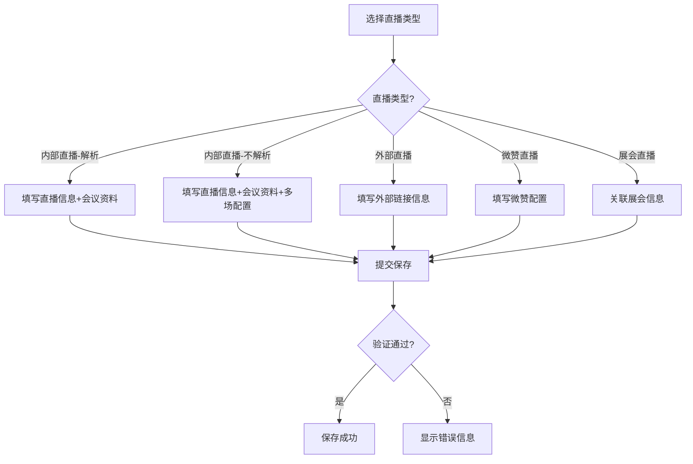

# 直播管理功能设计文档

## 1. 功能概述

直播管理功能允许管理员创建、编辑和管理不同类型的直播活动。系统支持多种直播类型，包括内部直播（解析互动数据和不解析互动数据两种模式）、外部链接直播、微赞直播和展会直播。

## 2. 功能列表

| 功能模块 | 功能名称 | 描述 |
|---------|---------|------|
| 直播类型管理 | 直播类型选择 | 支持选择内部直播、外部直播、微赞直播、展会直播等多种类型 |
| 内部直播配置 | 内部直播-解析模式 | 提供会议资料、报名功能，并解析互动数据 |
| 内部直播配置 | 内部直播-不解析模式 | 提供会议资料和报名功能，但不解析互动数据 |
| 直播信息管理 | 直播基本信息 | 直播名称、开播时间、封面图片、简介等 |
| 报名管理 | 报名设置 | 开启/关闭报名、报名截止时间、是否需要审核 |
| 多场直播配置 | 多场次管理 | 支持创建多场直播，每场可单独设置名称、时间和链接 |
| 会议资料管理 | 资料上传 | 支持上传PDF格式的会议介绍、会议议程和会议资料 |
| 会议资料管理 | 下载权限控制 | 控制会议资料是否允许下载 |

## 3. 详细功能描述

### 3.1 直播类型管理

**功能描述**：管理员可以根据直播活动的性质选择合适的直播类型。

**功能结构**：
- 直播类型选择界面以卡片形式展示
- 每种类型包含图标、名称和简要描述
- 选中的类型高亮显示

**支持的直播类型**：
- 内部直播-解析：仅限微赞链接，支持维护，解析互动数据
- 内部直播-不解析：提供会议资料和报名功能，但不解析互动数据
- 外部直播：通过外部平台进行直播
- 微赞直播：基于微赞平台创建和管理的直播
- 展会直播：关联展会管理模块的直播

### 3.2 内部直播配置

#### 3.2.1 内部直播-解析模式

**功能描述**：适用于需要解析互动数据的内部直播活动。

**输入**：
- 直播名称
- 开播时间
- 直播封面
- 直播简介
- 会议资料
- 报名设置

**输出**：创建包含所有配置信息的直播活动，系统会解析互动数据。

#### 3.2.2 内部直播-不解析模式

**功能描述**：适用于只需展示直播内容，不需要解析互动数据的场景。

**输入**：
- 直播名称
- 开播时间
- 直播封面
- 直播简介
- 会议资料
- 报名设置
- 多场直播配置（可选）

**输出**：创建包含所有配置信息的直播活动，但不解析互动数据。

### 3.3 直播基本信息管理

**功能描述**：设置直播活动的基本信息。

**字段说明**：
- 直播名称（必填）：直播活动的标题
- 开播时间（必填）：直播开始的时间，不能早于当前时间
- 直播封面（可选）：推荐尺寸1920x1080，支持jpg、png格式
- 直播简介（可选）：直播活动的简要描述，最多500字符

### 3.4 报名管理

**功能描述**：控制是否允许用户报名参加直播活动。

**配置项**：
- 启用/禁用报名功能
- 报名截止时间（启用报名时必填）：必须早于直播开始时间
- 是否需要审核：设置报名信息是否需要人工审核

### 3.5 多场直播配置

**功能描述**：支持在一个直播活动中设置多个场次。

**配置项**：
- 启用/禁用多场直播
- 每场直播配置：场次名称、场次时间、场次直播链接
- 支持动态添加和删除场次

### 3.6 会议资料管理

**功能描述**：管理与直播活动相关的会议资料。

**配置项**：
- 资料类型：会议介绍、会议议程、会议资料
- PDF文件上传：仅支持PDF格式，单文件大小不超过50MB
- 下载权限控制：设置资料是否允许下载
- 支持动态添加和删除资料

## 4. 功能之间的逻辑关系

### 4.1 交互效果

- 选择不同的直播类型，系统会动态显示对应的配置表单
- 启用报名功能后，才显示报名截止时间和审核设置
- 启用多场直播后，才显示场次管理界面
- 上传文件时，系统会进行格式和大小验证

### 4.2 数据流向

1. 管理员在界面填写直播配置信息
2. 系统验证输入数据的合法性
3. 验证通过后，将数据格式化为API所需的结构
4. 发送请求到后端进行数据保存
5. 后端返回保存结果，前端显示成功或失败提示

## 5. 业务流程图

## 6. 异常处理机制

### 6.1 输入验证

- 必填字段验证：确保必填信息已填写
- 格式验证：确保时间、URL等格式正确
- 文件类型和大小验证：限制上传文件的格式和大小

### 6.2 错误提示

- 表单验证失败时，在对应字段下方显示具体错误信息
- 文件上传格式错误时，显示"只能上传PDF格式文件！"
- 文件大小超限，显示"文件大小不能超过50MB！"
- 保存失败时，显示全局错误提示

## 7. 最新功能更新（2024年）

### 7.1 新增"内部直播-不解析"类型

**更新内容**：
- 添加新的直播类型：内部直播-不解析
- 该类型提供会议资料和报名功能，但不解析互动数据
- 支持多场直播配置

**更新时间**：2024年

### 7.2 优化handleSubmit函数

**更新内容**：
- 扩展内部直播类型验证范围，同时支持internal_parse和internal_no_parse
- 统一错误提示文本，提高用户体验一致性
- 添加多场直播场次数量验证，确保场次数量合理
- 格式化场次时间数据，确保后端数据处理正确
- 在liveData对象中新增meetingMaterials和sessions字段，完整保存会议资料和场次数据

**更新时间**：2024年

## 8. 技术实现细节

### 8.1 渲染逻辑

- 使用renderConfigForm函数根据选中的直播类型渲染不同的配置表单
- 为internal_no_parse类型提供专门的renderInternalUnparsedForm函数

### 8.2 数据处理

- 使用React Hook管理表单状态
- handleSubmit函数负责数据验证和提交
- 支持会议资料和多场直播数据的完整处理

### 8.3 前端组件

- 使用Element UI组件库构建界面
- 使用Form组件进行表单管理
- 使用Upload组件处理文件上传
- 使用Select组件处理下拉选择
- 使用DatePicker组件处理时间选择
- 使用Switch组件处理开关设置